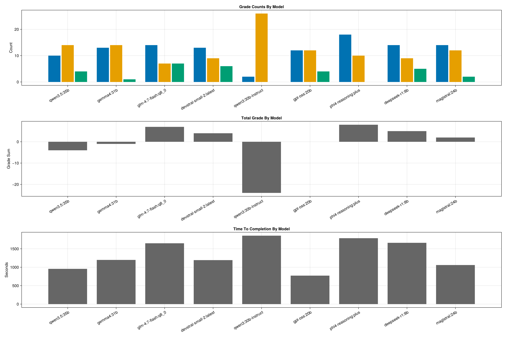

# Evaluation Summary

- CSV source: `/workdir/dev/QuantumSavory/QuantumSavory.jl/.agents/evals/anythingllm-eval-results.csv`
- Rows: 252
- Queries: 28
- Models: deepseek-r1:8b, devstral-small-2:latest, gemma4:31b, glm-4.7-flash:q8_0, gpt-oss:20b, magistral:24b, phi4-reasoning:plus, qwen3.5:35b, qwen3:30b-instruct

## Plots

## Most Commonly Wrong (-1)

| **Query**                      | **deepseek-r1:8b** | **devstral-small-2:latest** | **gemma4:31b** | **glm-4.7-flash:q8\_0** | **gpt-oss:20b** | **magistral:24b** | **phi4-reasoning:plus** | **qwen3.5:35b** | **qwen3:30b-instruct** | **Average** |
|:-------------------------------|:------------------:|:---------------------------:|:--------------:|:-----------------------:|:---------------:|:-----------------:|:-----------------------:|:---------------:|:----------------------:|------------:|
| performance-bottlenecks        |         -1         |             -1              |       -1       |           -1            |       -1        |        -1         |           -1            |       -1        |           -1           |       -1.00 |
| delayed-quantum-channel        |         -1         |             -1              |       0        |           -1            |       -1        |        -1         |           -1            |       -1        |           -1           |       -0.89 |
| factorization-time-noise       |         -1         |             -1              |       -1       |           -1            |       -1        |         0         |           -1            |       -1        |           -1           |       -0.89 |
| live-visualization             |         0          |             -1              |       -1       |           -1            |       -1        |        -1         |           -1            |       -1        |           -1           |       -0.89 |
| repeater-stack-plan            |         -1         |             -1              |       0        |           -1            |       -1        |        -1         |           -1            |       -1        |           -1           |       -0.89 |
| representable-hardware         |         -1         |             -1              |       -1       |           -1            |       -1        |         0         |           +1            |       -1        |           -1           |       -0.67 |
| wait-for-tags                  |         -1         |             -1              |       +1       |           -1            |       -1        |        -1         |           -1            |       +1        |           -1           |       -0.56 |
| channel-modeling               |         -1         |             -1              |       0        |            0            |       -1        |        -1         |           -1            |        0        |           -1           |       -0.67 |
| supported-protocols            |         -1         |             +1              |       0        |           -1            |       -1        |        -1         |           -1            |        0        |           -1           |       -0.56 |
| stateszoo-extension            |         -1         |             -1              |       0        |            0            |       -1        |        -1         |           -1            |        0        |           0            |       -0.56 |
| noninstant-gates               |         -1         |             -1              |       0        |            0            |       -1        |        -1         |           +1            |       -1        |           +1           |       -0.33 |
| debugging-inspection           |         +1         |             -1              |       +1       |           +1            |       -1        |        -1         |           -1            |        0        |           -1           |       -0.22 |
| weighted-states                |         -1         |             -1              |       +1       |           -1            |       -1        |        -1         |           +1            |       +1        |           +1           |       -0.11 |
| backend-extension              |         0          |             -1              |       -1       |            0            |       -1        |         0         |           +1            |       -1        |           0            |       -0.33 |
| symbolic-frontend              |         -1         |             +1              |       -1       |           +1            |       -1        |        +1         |           +1            |        0        |           -1           |       +0.00 |
| choose-backend-stabilizer      |         +1         |             +1              |       -1       |           +1            |       -1        |        +1         |           +1            |       -1        |           +1           |       +0.33 |
| choose-backend-bosonic         |         +1         |             +1              |       +1       |           +1            |       -1        |        -1         |           +1            |       +1        |           +1           |       +0.56 |
| classical-vs-quantum-transport |         -1         |             +1              |       +1       |           +1            |       -1        |        +1         |           +1            |       +1        |           +1           |       +0.56 |
| register-vs-regnet             |         +1         |             -1              |       +1       |           +1            |       -1        |        +1         |           +1            |       +1        |           +1           |       +0.56 |
| state-explorer                 |         -1         |             +1              |       +1       |           +1            |       -1        |        +1         |           +1            |       +1        |           +1           |       +0.56 |
| first-steps                    |         0          |              0              |       0        |            0            |       -1        |         0         |           +1            |       +1        |           +1           |       +0.22 |
| classical-coordination         |         0          |             +1              |       +1       |            0            |       -1        |        +1         |           +1            |       +1        |           +1           |       +0.56 |
| abstraction-boundaries         |         +1         |             +1              |       +1       |           +1            |       +1        |        +1         |           +1            |       +1        |           -1           |       +0.78 |
| async-timing                   |         +1         |             +1              |       +1       |           +1            |       -1        |        +1         |           +1            |       +1        |           +1           |       +0.78 |
| modeling-limitations           |         +1         |             +1              |       +1       |           +1            |       -1        |        +1         |           +1            |       +1        |           +1           |       +0.78 |
| scope-overview                 |         +1         |             +1              |       +1       |           +1            |       -1        |        +1         |           +1            |       +1        |           +1           |       +0.78 |
| zoo-selection                  |         +1         |             +1              |       +1       |           +1            |       -1        |        +1         |           +1            |       +1        |           +1           |       +0.78 |

## Most Commonly Right (+1)

| **Query**                      | **deepseek-r1:8b** | **devstral-small-2:latest** | **gemma4:31b** | **glm-4.7-flash:q8\_0** | **gpt-oss:20b** | **magistral:24b** | **phi4-reasoning:plus** | **qwen3.5:35b** | **qwen3:30b-instruct** | **Average** |
|:-------------------------------|:------------------:|:---------------------------:|:--------------:|:-----------------------:|:---------------:|:-----------------:|:-----------------------:|:---------------:|:----------------------:|------------:|
| qchannel-routing               |         +1         |             +1              |       +1       |           +1            |       +1        |        +1         |           +1            |       +1        |           +1           |       +1.00 |
| abstraction-boundaries         |         +1         |             +1              |       +1       |           +1            |       +1        |        +1         |           +1            |       +1        |           -1           |       +0.78 |
| async-timing                   |         +1         |             +1              |       +1       |           +1            |       -1        |        +1         |           +1            |       +1        |           +1           |       +0.78 |
| modeling-limitations           |         +1         |             +1              |       +1       |           +1            |       -1        |        +1         |           +1            |       +1        |           +1           |       +0.78 |
| scope-overview                 |         +1         |             +1              |       +1       |           +1            |       -1        |        +1         |           +1            |       +1        |           +1           |       +0.78 |
| zoo-selection                  |         +1         |             +1              |       +1       |           +1            |       -1        |        +1         |           +1            |       +1        |           +1           |       +0.78 |
| choose-backend-bosonic         |         +1         |             +1              |       +1       |           +1            |       -1        |        -1         |           +1            |       +1        |           +1           |       +0.56 |
| classical-vs-quantum-transport |         -1         |             +1              |       +1       |           +1            |       -1        |        +1         |           +1            |       +1        |           +1           |       +0.56 |
| register-vs-regnet             |         +1         |             -1              |       +1       |           +1            |       -1        |        +1         |           +1            |       +1        |           +1           |       +0.56 |
| state-explorer                 |         -1         |             +1              |       +1       |           +1            |       -1        |        +1         |           +1            |       +1        |           +1           |       +0.56 |
| classical-coordination         |         0          |             +1              |       +1       |            0            |       -1        |        +1         |           +1            |       +1        |           +1           |       +0.56 |
| choose-backend-stabilizer      |         +1         |             +1              |       -1       |           +1            |       -1        |        +1         |           +1            |       -1        |           +1           |       +0.33 |
| symbolic-frontend              |         -1         |             +1              |       -1       |           +1            |       -1        |        +1         |           +1            |        0        |           -1           |       +0.00 |
| weighted-states                |         -1         |             -1              |       +1       |           -1            |       -1        |        -1         |           +1            |       +1        |           +1           |       -0.11 |
| first-steps                    |         0          |              0              |       0        |            0            |       -1        |         0         |           +1            |       +1        |           +1           |       +0.22 |
| debugging-inspection           |         +1         |             -1              |       +1       |           +1            |       -1        |        -1         |           -1            |        0        |           -1           |       -0.22 |
| noninstant-gates               |         -1         |             -1              |       0        |            0            |       -1        |        -1         |           +1            |       -1        |           +1           |       -0.33 |
| wait-for-tags                  |         -1         |             -1              |       +1       |           -1            |       -1        |        -1         |           -1            |       +1        |           -1           |       -0.56 |
| backend-extension              |         0          |             -1              |       -1       |            0            |       -1        |         0         |           +1            |       -1        |           0            |       -0.33 |
| supported-protocols            |         -1         |             +1              |       0        |           -1            |       -1        |        -1         |           -1            |        0        |           -1           |       -0.56 |
| representable-hardware         |         -1         |             -1              |       -1       |           -1            |       -1        |         0         |           +1            |       -1        |           -1           |       -0.67 |

## Most Commonly Meh (0)

| **Query**                | **deepseek-r1:8b** | **devstral-small-2:latest** | **gemma4:31b** | **glm-4.7-flash:q8\_0** | **gpt-oss:20b** | **magistral:24b** | **phi4-reasoning:plus** | **qwen3.5:35b** | **qwen3:30b-instruct** | **Average** |
|:-------------------------|:------------------:|:---------------------------:|:--------------:|:-----------------------:|:---------------:|:-----------------:|:-----------------------:|:---------------:|:----------------------:|------------:|
| first-steps              |         0          |              0              |       0        |            0            |       -1        |         0         |           +1            |       +1        |           +1           |       +0.22 |
| backend-extension        |         0          |             -1              |       -1       |            0            |       -1        |         0         |           +1            |       -1        |           0            |       -0.33 |
| stateszoo-extension      |         -1         |             -1              |       0        |            0            |       -1        |        -1         |           -1            |        0        |           0            |       -0.56 |
| channel-modeling         |         -1         |             -1              |       0        |            0            |       -1        |        -1         |           -1            |        0        |           -1           |       -0.67 |
| classical-coordination   |         0          |             +1              |       +1       |            0            |       -1        |        +1         |           +1            |       +1        |           +1           |       +0.56 |
| noninstant-gates         |         -1         |             -1              |       0        |            0            |       -1        |        -1         |           +1            |       -1        |           +1           |       -0.33 |
| supported-protocols      |         -1         |             +1              |       0        |           -1            |       -1        |        -1         |           -1            |        0        |           -1           |       -0.56 |
| debugging-inspection     |         +1         |             -1              |       +1       |           +1            |       -1        |        -1         |           -1            |        0        |           -1           |       -0.22 |
| delayed-quantum-channel  |         -1         |             -1              |       0        |           -1            |       -1        |        -1         |           -1            |       -1        |           -1           |       -0.89 |
| factorization-time-noise |         -1         |             -1              |       -1       |           -1            |       -1        |         0         |           -1            |       -1        |           -1           |       -0.89 |
| live-visualization       |         0          |             -1              |       -1       |           -1            |       -1        |        -1         |           -1            |       -1        |           -1           |       -0.89 |
| repeater-stack-plan      |         -1         |             -1              |       0        |           -1            |       -1        |        -1         |           -1            |       -1        |           -1           |       -0.89 |
| representable-hardware   |         -1         |             -1              |       -1       |           -1            |       -1        |         0         |           +1            |       -1        |           -1           |       -0.67 |
| symbolic-frontend        |         -1         |             +1              |       -1       |           +1            |       -1        |        +1         |           +1            |        0        |           -1           |       +0.00 |

