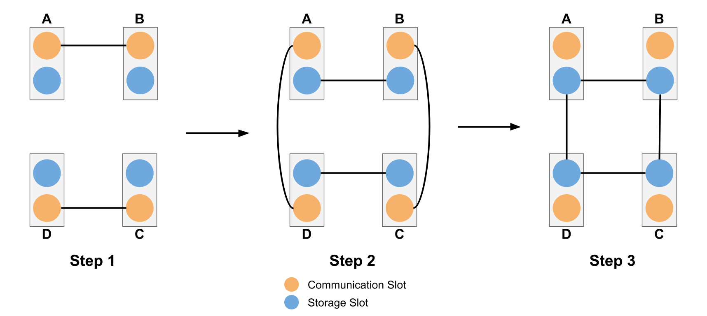

# Cluster-State Walkthrough

This page is a high-level how-to walkthrough for a more complete,
multi-component QuantumSavory simulation.

The example distributes a four-qubit cluster state across four network nodes
arranged in a square. Each node has a communication qubit, used to establish
pairwise entanglement with neighbors, and a storage qubit, where that
entanglement is moved and fused into the final multipartite resource state.

The point of this walkthrough is to show how a full-stack simulation is
structured:

- independent link-level entanglers can run in parallel when they do not
  compete for the same communication qubits
- once Bell pairs exist, circuits move or fuse those resources into the storage
  layer
- protocol logic, waiting, and concurrency live in the discrete-event layer
  rather than being hand-managed in user code
- the state preparation and fusion steps can still be written symbolically, so
  the backend choice stays separate from the protocol logic

This is not a single-focus tutorial. It is closer to a how-to sketch of how
one assembles registers, protocols, symbolic states, and concurrency into a
larger simulation workflow.

## Where To Go Next

- Read [Architecture and Mental Model](@ref architecture) for the abstractions
  behind this workflow.
- Read [Metadata and Protocol Composition](@ref metadata-plane) for how
  protocols coordinate without tight coupling.
- Read [How-To Guides](@ref) for larger runnable end-to-end examples.
