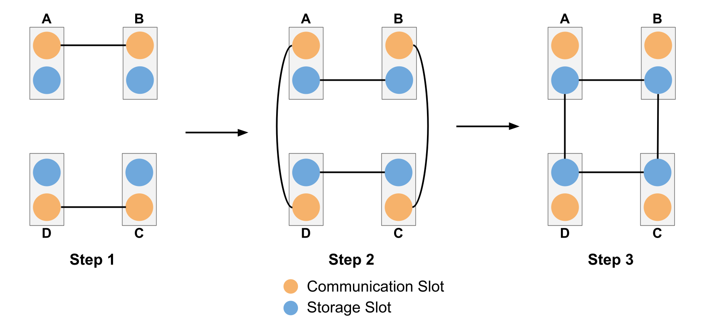

# Cluster-State Walkthrough

This page is a high-level how-to walkthrough for a more complete,
multi-component QuantumSavory simulation.

The example distributes a four-qubit cluster state across four network nodes
arranged in a square. Each node has a communication qubit, used to establish
pairwise entanglement with neighbors, and a storage qubit, where that
entanglement is moved and fused into the final multipartite resource state.

The diagram reads from left to right and shows one valid schedule for the four
edges of the square:

1. **Step 1:** [`EntanglerProt`](@ref) works on the A-B and C-D edges through
   the orange communication slots. These edges do not share a node, so the two
   entanglers can run in parallel. After both finish, [`Fusion`](@ref)
   transfers these graph-state edges to the blue storage slots.
2. **Step 2:** The horizontal edges are now stored in the blue slots. The
   orange slots can be reused to entangle A-D and B-C in parallel.
3. **Step 3:** `Fusion` consumes the second round of communication-slot Bell
   pairs and adds those edges to the stored state. The four blue storage slots
   now hold the square cluster state.

The two parallel rounds can occur in the opposite order. The important rule is
that edges in one round do not share a node, so they do not compete for the
same communication slot.

The point of this walkthrough is to show how a full-stack simulation is
structured:

- independent link-level entanglers can run in parallel when they do not
  compete for the same communication qubits
- after all entanglers in a round finish, the `Fusion` circuit transfers those
  edges to the storage layer and frees the communication slots for the next
  round
- protocol logic, waiting, and concurrency live in the discrete-event layer
  rather than being hand-managed in user code
- the state preparation and fusion steps can still be written symbolically, so
  the backend choice stays separate from the protocol logic

This is not a single-focus tutorial. It is closer to a how-to sketch of how
one assembles registers, protocols, symbolic states, and concurrency into a
larger simulation workflow.

## Where To Go Next

- Read [Architecture and Mental Model](@ref architecture) for the abstractions
  behind this workflow.
- Read [Metadata and Protocol Composition](@ref metadata-plane) for how
  protocols coordinate without tight coupling.
- Read [How-To Guides](@ref) for larger runnable end-to-end examples.
