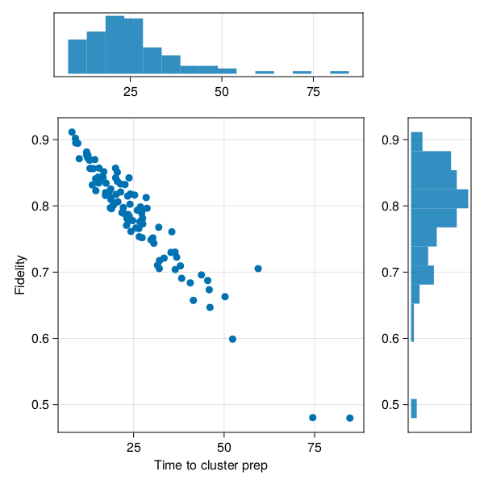

# [Cluster State on Color Centers](@id Cluster-State-on-Color-Centers)

[Cluster states](https://en.wikipedia.org/wiki/Cluster_state) are highly entangled state of qubits useful as a [computational resource](https://en.wikipedia.org/wiki/One-way_quantum_computer).
The cluster state is also a [graph state](https://en.wikipedia.org/wiki/Graph_state) where the graph has a 2D grid topology.

One interesting hardware implementation involves entangling a large number of color centers[^1].

[^1]: [choi2019percolation](@cite)

We will build a simulator for such a piece of hardware.
Each node will be a register of one electron spin for networking and one nuclear spin in which the actual long-term entanglement is "stored".

!!! info "Low Level Implementation"
    This is a very low-level implementation. You would be better of using already implemented reusable protocols like [`EntanglerProt`](https://qs.quantumsavory.org/dev/API_ProtocolZoo/#QuantumSavory.ProtocolZoo.EntanglerProt), and a ready-made noisy entangled state from [`StatesZoo`](@ref Predefined-Models-of-Quantum-States) such as [`BarrettKokBellPair`](@ref). On the other hand, the setup here is a simple way to learn about making discrete event simulations without depending on a lot of extra library functionality and opaque black boxes.

The visualization below shows an example of the state being generated, together with tracking the state of various locks and other metadata that needs to be tracked.

```@raw html
<video src="../colorcentermodularcluster-02.simdashboard.mp4" autoplay loop muted></video>
```

Of interest is both the time it takes to prepare a full cluster state, as well as the fidelity of state being prepared in that fashion.
The fidelity can be lowered due to the numerous noise processes experience by the hardware.
The duration can be quite long due to the low efficiencies of photon capture during typical entanglement procedures.
The plot below shows the distribution of these figures of merit, sampled from a large number of independent runs of the simulation (gathering the entirety of this date takes less than a second).



For organizing the simulation and simplifying the digital and analog quantum dynamics,
we will use the star of `QuantumSavory.jl`, namely the [`Register`](@ref) data structure.
For a convenient data structure to track per-node metadata in a graph (network) we will use the [`RegisterNet`](@ref) structure.

Moreover, behind the scenes `QuantumSavory.jl` will use:

- `ConcurrentSim.jl` for discrete event scheduling and simulation;
- `Makie.jl` together with our custom plotting recipes for visualizations;
- `QuantumOptics.jl` for low-level quantum states.

The user does not need to know much about these libraries, but if they wish, it is easy for them to peek behind the scenes and customize their use.

Below we embed a live version of the simulation (hosted at [areweentangledyet.com/colorcentermodularcluster/](https://areweentangledyet.com/colorcentermodularcluster/)):

```@raw html
<iframe class="liveexample" src="https://areweentangledyet.com/colorcentermodularcluster/" style="height:850px;width:1250px;"></iframe>
```

The source code is in the [`examples/colorcentermodularcluster`](https://github.com/QuantumSavory/QuantumSavory.jl/tree/master/examples/colorcentermodularcluster) folder.
All of the base functionality lives in `setup.jl`, while the three numbered scripts run it in different circumstances:

1. **`1_time_to_connected.jl`** — runs many independent instances and gathers statistics on the time-to-completion and fidelity;
2. **`2_real_time_visualization.jl`** — runs a single instance with a detailed live dashboard (the video at the top of this page);
3. **`3_makie_interactive.jl`** — wraps both of the above into an interactive web app.

## Network Setup

Each node of the cluster is a [`Register`](@ref) holding two qubits: an electron spin used for networking, and a nuclear spin used as long-term memory.
The two spins decay at different rates, so each is given its own [`T2Dephasing`](@ref) background process.
The nodes are laid out on a `2×3` grid.

```julia
graph = grid([2,3])
traits = [Qubit(), Qubit()] # electron spin and nuclear spin
bg = [T2Dephasing(root_conf[:T₂ᵉ]), T2Dephasing(root_conf[:T₂ⁿ])]
net = RegisterNet(graph, [Register(traits, bg) for i in vertices(graph)])
```

The various hardware parameters (spin lifetimes, optical efficiencies, hyperfine coupling, etc.) are collected in a `root_conf` dictionary, with literature references attached as comments.
`derive_conf` turns these physical parameters into the derived quantities the simulation actually needs — most importantly the per-attempt entanglement success probability `Pˢᵘᶜᶜ` (and the geometric distribution `𝒟ˢᵘᶜᶜ` for the number of attempts before a success), and the noisy Barrett-Kok Bell state `ψᴮᴷ`:

```julia
ηᵗᵒᵗᵃˡ = ηᵒᵖᵗ * ξᴼᴮ * Fᵖᵘʳᶜ / (Fᵖᵘʳᶜ-1+(ξᴰᵂ*ξᴱ)^-1)
Pˢᵘᶜᶜ = 0.5 * ηᵗᵒᵗᵃˡ^2
𝒟ˢᵘᶜᶜ = Geometric(Pˢᵘᶜᶜ)

ψᴮᴷ = SProjector((Z₁⊗Z₁ + Z₂⊗Z₂) / √2)
dep(p,o) = p*o + (1-p)*MixedState(o)
ψᴮᴷ = dep(root_conf[:Fᵉⁿᵗ], ψᴮᴷ)        # mix in some white noise to model imperfect entanglement
```

Note that this noisy Bell state is built here by hand from a simple depolarizing model, rather than using a ready-made parametrized state like [`BarrettKokBellPair`](@ref) from [`StatesZoo`](@ref Predefined-Models-of-Quantum-States).

## Entangling Neighbors

The heart of the simulation is the `barrettkok` process, a [`@resumable`](https://github.com/JuliaDynamics/ResumableFunctions.jl) function that models a single Barrett-Kok entanglement attempt between two neighboring nodes.

One instance of `barrettkok` runs on every edge of the network:

```julia
for (;src,dst) in edges(net)
    @process barrettkok(sim, net, src, dst, conf)
end
```

**Reserving the hardware.**
First it makes sure no other process is already working on this edge, then reserves the electron spins of both nodes with a `nongreedymultilock` (a multi-resource lock that avoids deadlock by never holding a partial set of locks):

```julia
link_resource = net[(nodea, nodeb), :link_queue]
islocked(link_resource) && return
espin_slots = [net[nodea, 1], net[nodeb, 1]]
@yield request(link_resource)
@yield @process nongreedymultilock(env, espin_slots)
```

**Waiting for a photon.**
Rather than simulating each individual optical attempt, we sample the number of attempts needed for the first success from the geometric distribution computed earlier, and convert that into a waiting time:

```julia
attempts  = 1 + rand(conf[:𝒟ˢᵘᶜᶜ])
duration  = attempts * conf[:τᵉⁿᵗ]
@yield timeout(env, duration)
bk_el_init(env, rega, regb, conf) # write the noisy Bell pair into the two electron spins
```

`bk_el_init` initializes the two electron spins into the noisy Bell state `ψᴮᴷ` and applies a Hadamard.

**Swapping into nuclear memory.**
The electron spins are only used for networking; the entanglement must be moved into the long-lived nuclear spins so that the electron can be reused for the next link.
After reserving the nuclear spins, each node performs a local CPHASE between its electron and nuclear spin, followed by a projective measurement of the electron:

```julia
function bk_swap(env, reg, conf)
    if !isassigned(reg, 2)
        initialize!(reg[2]; time=now(env))
        apply!(reg[2], H)
    end
    apply!([reg[1],reg[2]], CPHASE; time=now(env))
    off = project_traceout!(reg[1], σˣ)
    if rand() > conf[:Fᵐᵉᵃˢ] # model measurement infidelity by flipping the outcome
        off = off%2 + 1
    end
    return off
end
```

**Classical correction.**
The two measurement outcomes determine whether a `Z` correction has to be applied on the partner's nuclear spin.
In a more complete implementation this would be tracked in a Pauli frame rather than applied to the state directly:

```julia
r1 = bk_swap(env, rega, conf)
r2 = bk_swap(env, regb, conf)
r1==2 && apply!(regb[2], Z)
r2==2 && apply!(rega[2], Z)
net[(nodea, nodeb), :link_register] = true     # record success
release.(nspin_slots); release.(espin_slots); release(link_resource)
```

Once `link_register` is set to `true` on every edge, the full `2×3` cluster state has been prepared.

## Figures of Merit

A cluster state is a graph state, so it is fully characterized by a set of stabilizers — one per vertex, of the form ``X_v \prod_{w \sim v} Z_w`` over each vertex and its neighbors.
We pre-build these stabilizer observables for every possible neighborhood size:

```julia
observables = [reduce(⊗, [σˣ, fill(σᶻ,n)...]) for n in 1:5]
```

The expectation value of the stabilizer attached to a vertex is a convenient per-node fidelity proxy: it is `1` for a perfect cluster state and degrades as the nuclear spins dephase.
We compute it for each vertex by selecting the observable matching that vertex's degree and evaluating it over the vertex and its neighbors:

```julia
fid = map(vertices(net)) do v
    neighs = neighbors(net, v)
    obs    = observables[length(neighs)]
    regs   = [net[i, 2] for i in [v, neighs...]]    # the nuclear spins
    real(observable(regs, obs; time=now(sim)))
end
```

## Running the Simulation

The first script, `1_time_to_connected.jl`, runs the simulation forward one discrete event at a time until every edge has been entangled, then reports the elapsed simulated time and the mean stabilizer expectation:

```julia
function run_until_connected(root_conf)
    net, sim, observables, conf = prep_sim(root_conf)
    while !all([net[v,:link_register] for v in edges(net)])
        ConcurrentSim.step(sim)
    end
    fid = map(vertices(net)) do v
        neighs = neighbors(net, v)
        obs    = observables[length(neighs)]
        regs   = [net[i, 2] for i in [v, neighs...]]
        real(observable(regs, obs; time=now(sim)))
    end
    now(sim), mean(fid)
end
```

Because each instance is independent, we can sample many of them in parallel and plot the joint distribution of completion time versus fidelity — this is the scatter-and-histogram figure shown near the top of the page:

```julia
r  = tmap((_)->run_until_connected(root_conf), 1:100)
df = rename(DataFrame(r), [:time, :fid])
```

## Figures of Merit and Visualizations

The second script, `2_real_time_visualization.jl`, advances a single instance with `run(sim, t)` and records the dashboard video shown at the top of this page.
It combines three of `QuantumSavory`'s plotting recipes:

- [`registernetplot_axis`](@ref) draws the registers and their quantum states on the grid;
- [`resourceplot_axis`](@ref) tracks the locks and queues (`:link_queue`, `:decay_queue`) and the `:link_register` flags;
- a hand-made overlay of `linesegments!` colors each cluster edge by its current stabilizer expectation, alongside a stairs plot of the best/worst/average node fidelity over time.

```julia
step_ts = range(0, tscale, step=tscale/500)
record(F, "colorcentermodularcluster-02.simdashboard.mp4", step_ts; framerate=10) do t
    run(sim, t)
    # recompute per-node fidelities and notify the observables driving the plots
    ...
end
```

!!! note
    To learn more about how to visualize these data structures as the simulation proceeds, consult the [Visualizations](@ref Visualizations) page.

The third script, `3_makie_interactive.jl`, wraps both the statistics gathering and the live dashboard into a single interactive web app (built with `WGLMakie` and `Bonito`), with sliders to vary the hardware parameters in real time.
This is what is embedded in the live example above.

## Summary of `QuantumSavory` tools employed in the simulation

We used the [`Register`](@ref) and [`RegisterNet`](@ref) data structures to track both the quantum states and the classical per-node/per-edge metadata of our mixed analog-digital dynamics.

Much of the analog dynamics was implicit through the use of [backgrounds,
declaring the noise properties of the electron and nuclear spins](@ref "Background Noise Processes").

The discrete-event protocol itself was written by hand as a [`@resumable`](https://github.com/JuliaDynamics/ResumableFunctions.jl) function scheduled on the `ConcurrentSim.jl` event loop, using
- `nongreedymultilock` and `Resource` locks for coordinating access to shared hardware
- [`initialize!`](@ref) and [`apply!`](@ref) for state preparation and gates
- [`project_traceout!`](@ref) for the projective electron measurements
- [`observable`](@ref) for evaluating the cluster-state stabilizers

Many of the above functions take the `time` keyword argument, which ensures that various background analog processes are simulated before the given operation is performed.

Of note is that we also used
`Makie.jl` for plotting and `ConcurrentSim.jl` for discrete event scheduling,
many of them under the hood without being invoked directly.