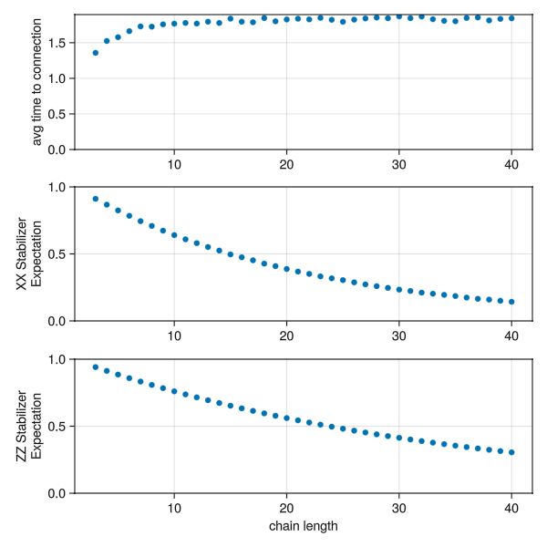

# A Study of Congestions over a Repeater Chain

A simple example to study congestion on a chain of quantum repeaters.

Each node in the chain holds a small number of qubits, and three kinds of processes compete for them:
an `entangler` generating raw Bell pairs between neighbors, a `swapper` extending those pairs into longer-range links, and a `consumer` draining finished end-to-end pairs.
Because every register only has a handful of slots, these processes get in each other's way — entanglement piles up faster than it can be swapped and consumed.
The goal of this how-to is to measure how that congestion grows as the chain gets longer.

!!! info "Low Level Implementation"
    This is a very low-level implementation. You would be better of using already implemented reusable protocols like [`EntanglerProt`](https://qs.quantumsavory.org/dev/API_ProtocolZoo/#QuantumSavory.ProtocolZoo.EntanglerProt) and [`SwapperProt`](https://qs.quantumsavory.org/dev/API_ProtocolZoo/#QuantumSavory.ProtocolZoo.SwapperProt), together with the [tagging and querying system](@ref tagging-and-querying) for tracking classical metadata. On the other hand, the setup here is a simple way to learn about making discrete event simulations without depending on a lot of extra library functionality and opaque black boxes.

Below we embed a live version of the simulation (hosted at [areweentangledyet.com/congestionchain/](https://areweentangledyet.com/congestionchain/)):

```@raw html
<iframe class="liveexample" src="https://areweentangledyet.com/congestionchain/" style="height:800px;width:850px;"></iframe>
```

The dashboard above shows the chain on the left and the quality of the consumed end-to-end pairs (the `XX` and `ZZ` stabilizer expectations) on the right:

```@raw html
<video src="../congestionchain.mp4" autoplay loop muted></video>
```

The source code is in the [`examples/congestionchain`](https://github.com/QuantumSavory/QuantumSavory.jl/tree/master/examples/congestionchain) folder.
All of the base functionality lives in `setup.jl`, while the three numbered scripts run it in different circumstances:

1. **`1_visualization.jl`** — runs a single Monte Carlo simulation of one chain with a live dashboard (the video above);
2. **`2_makie_interactive.jl`** — wraps that into an interactive web app;
3. **`3_aggregate_of_multiple_simulations.jl`** — runs many simulations across a range of chain lengths and plots the averaged statistics.

This example is a close cousin of the [low-level first-generation repeater](@ref First-Generation-Quantum-Repeater); if you want a more detailed walkthrough of the same hand-written entangler/swapper machinery, that page goes deeper.

## Network Setup

The chain is a linear graph of `length` registers, each holding `regsize` qubits, all with the same [`T2Dephasing`](@ref) background.
`simulation_setup` builds the [`RegisterNet`](@ref) and attaches, on every node, an `:enttrackers` array recording which remote qubit (if any) each local qubit is entangled with — the classical bookkeeping that the ProtocolZoo's tag system would otherwise handle for you:

```julia
function simulation_setup(length, regsize, T2; representation = QuantumOpticsRepr)
    registers = [Register([Qubit() for _ in 1:regsize],
                          [representation() for _ in 1:regsize],
                          [T2Dephasing(T2) for _ in 1:regsize]) for _ in 1:length]
    network = RegisterNet(grid([length]), registers)
    sim = get_time_tracker(network)
    for v in vertices(network)
        network[v,:enttrackers] = Any[nothing for i in 1:length]
    end
    sim, network
end
```

The raw Bell pair shared by the entangler is a ready-made noisy state from [`StatesZoo`](@ref Predefined-Models-of-Quantum-States), the [`DepolarizedBellPair`](@ref) parametrized by a single fidelity `F`:

```julia
noisy_pair_func(F) = DepolarizedBellPair(; F)
```

!!! note
    Unlike the [color-center example](@ref Cluster-State-on-Color-Centers), which builds its noisy Bell state by hand, here we reuse a predefined state from `StatesZoo` and (below) a predefined swap circuit from `CircuitZoo`. The "low-level" part of this example is the hand-written processes and bookkeeping, not the quantum states or circuits.

## Entangler

One `entangler` runs on every edge. It repeatedly looks for a free qubit on each endpoint, locks them, waits an exponentially-distributed time to model the probabilistic entangling attempt, writes the noisy Bell pair into the two slots, and records the link in both nodes' `:enttrackers`:

```julia
@resumable function entangler(sim, network, nodea, nodeb, noisy_pair,
                              entangler_wait_time, entangler_busy_λ)
    while true
        ia = findfreequbit(network, nodea; constraint=:odd)
        ib = findfreequbit(network, nodeb; constraint=:even)
        if isnothing(ia) || isnothing(ib)
            @yield timeout(sim, entangler_wait_time)   # all slots busy — back off and retry
            continue
        end
        slota = network[nodea,ia]; slotb = network[nodeb,ib]
        @yield request(slota) & request(slotb)
        @yield timeout(sim, rand(Exponential(entangler_busy_λ)))
        initialize!((network[nodea][ia], network[nodeb][ib]), noisy_pair; time=now(sim))
        network[nodea,:enttrackers][ia] = (node=nodeb, slot=ib)
        network[nodeb,:enttrackers][ib] = (node=nodea, slot=ia)
        unlock(slota); unlock(slotb)
    end
end
```

The `constraint=:odd`/`:even` restriction makes each node reserve one half of its slots for links to its left neighbor and the other half for links to its right, which is a simple way to avoid one direction starving the other.
When no free slot is available the process simply waits `entangler_wait_time` and retries — this back-off loop is exactly where congestion shows up.

## Swapper

One `swapper` runs on every node. It looks for a qubit entangled with some node to its left and another entangled with some node to its right, and fuses the two short links into one longer link with a Bell measurement:

```julia
@resumable function swapper(sim, network, node, swapper_wait_time, swapper_busy_time)
    while true
        qubit_pair = findswapablequbits(network, node)
        if isnothing(qubit_pair)
            @yield timeout(sim, swapper_wait_time)
            continue
        end
        q1, q2 = qubit_pair
        @yield request(network[node][q1]) & request(network[node][q2])
        @yield timeout(sim, swapper_busy_time)
        # bring the four involved qubits up to the current time, then swap
        uptotime!((reg[q1], reg1[node1.slot], reg[q2], reg2[node2.slot]), now(sim))
        swapcircuit(reg[q1], reg1[node1.slot], reg[q2], reg2[node2.slot])
        # rewrite the bookkeeping so the two remote endpoints now point at each other
        network[node1.node,:enttrackers][node1.slot] = node2
        network[node2.node,:enttrackers][node2.slot] = node1
        network[node,:enttrackers][q1] = nothing
        network[node,:enttrackers][q2] = nothing
        unlock(network[node][q1]); unlock(network[node][q2])
    end
end

swapcircuit = EntanglementSwap()   # from QuantumSavory.CircuitZoo
```

`findswapablequbits` always picks the *farthest* available neighbor on each side, so each swap extends the link as much as possible.
The actual quantum operation is the predefined `EntanglementSwap` circuit from [`CircuitZoo`](@ref Predefined-Quantum-Circuits); the [`uptotime!`](@ref) call first advances the four qubits' states to the present so the accumulated `T2` dephasing is applied before the swap.

## Consumer

One `consumer` sits at the two ends of the chain, draining finished end-to-end pairs.
For each consumed pair it records how long it had to wait since the previous one (the **time to connection**, the headline congestion metric) and the pair's `XX` and `ZZ` stabilizer expectations (its quality), then traces the qubits out so the slots can be reused:

```julia
@resumable function consumer(sim, network, node1, node2, consume_wait_time,
                             timelog, fidelityXXlog, fidelityZZlog)
    last_success = 0.0
    while true
        qubit_pair = findconsumablequbits(network, node1, node2)
        if isnothing(qubit_pair)
            @yield timeout(sim, consume_wait_time)
            continue
        end
        q1, q2 = qubit_pair
        @yield request(reg1[q1]) & request(reg2[q2])
        uptotime!((reg1[q1], reg2[q2]), now(sim))
        push!(fidelityXXlog[], real(observable((reg1[q1],reg2[q2]), XX; something=0.0, time=now(sim))))
        push!(fidelityZZlog[], real(observable((reg1[q1],reg2[q2]), ZZ; something=0.0, time=now(sim))))
        push!(timelog[], now(sim)-last_success)
        last_success = now(sim)
        traceout!(reg1[q1], reg2[q2])
        network[node1,:enttrackers][q1] = nothing
        network[node2,:enttrackers][q2] = nothing
        unlock(reg1[q1]); unlock(reg2[q2])
    end
end
```

## Running the Simulation

`1_visualization.jl` wires the three processes together and runs a single chain, recording the dashboard video shown at the top of the page:

```julia
sim, network = simulation_setup(len, regsize, T2)
noisy_pair = noisy_pair_func(F)

for (;src, dst) in edges(network)
    @process entangler(sim, network, src, dst, noisy_pair, entangler_wait_time, entangler_busy_λ)
end
for node in vertices(network)
    @process swapper(sim, network, node, swapper_wait_time, swapper_busy_time)
end
@process consumer(sim, network, 1, len, consume_wait_time, ts, fidXX, fidZZ)

for t in range(0, 1000, step=0.1)
    run(sim, t)
end
```

The visualization combines [`registernetplot_axis`](@ref) (the chain and its quantum states) with two scatter plots of the logged `XX`/`ZZ` expectations against time.

## Figures of Merit

The whole point of the study is in `3_aggregate_of_multiple_simulations.jl`: run the same setup across a range of chain lengths and look at the averages.
Each run logs the inter-consumption times and fidelities; averaging them per chain length gives the three trends below:

```julia
link_lengths = 3:40
Threads.@threads for i in eachindex(link_lengths)
    sim, network, ts, fidXX, fidZZ = prepare_singlerun(; len=link_lengths[i], ...)
    run(sim, 1000)
    results[i] = (ts, fidXX, fidZZ)
end

avgt  = [mean(res[1][]) for res in results]   # avg time between consumed pairs
avgxx = [mean(res[2][]) for res in results]
avgzz = [mean(res[3][]) for res in results]
```



As the chain grows, the average time between consumed end-to-end pairs climbs (more links must line up before a pair can be delivered) while the `XX`/`ZZ` stabilizer expectations fall (the longer a pair sits around, the more `T2` dephasing it accumulates). That trade-off between throughput and quality, driven by the limited number of qubits per node, is exactly the congestion this example sets out to illustrate.

## Summary of `QuantumSavory` tools employed in the simulation

We used the [`Register`](@ref) and [`RegisterNet`](@ref) data structures to track both the quantum states and the classical `:enttrackers` metadata of the chain.

Much of the analog dynamics was implicit through the use of [backgrounds,
declaring the noise properties of the qubits](@ref "Background Noise Processes"), applied at the right moments via the `time` keyword and [`uptotime!`](@ref).

The three discrete-event processes were hand-written as [`@resumable`](https://github.com/JuliaDynamics/ResumableFunctions.jl) functions scheduled on the `ConcurrentSim.jl` event loop, using
- `request`/`unlock` on register slots for coordinating access to shared hardware
- [`initialize!`](@ref) for state preparation, drawing the noisy pair from [`DepolarizedBellPair`](@ref) in [`StatesZoo`](@ref Predefined-Models-of-Quantum-States)
- `EntanglementSwap` from [`CircuitZoo`](@ref Predefined-Quantum-Circuits) for the swap
- [`observable`](@ref) for the `XX`/`ZZ` stabilizer expectations
- [`traceout!`](@ref) for deleting consumed qubits
