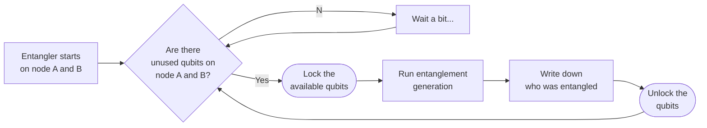
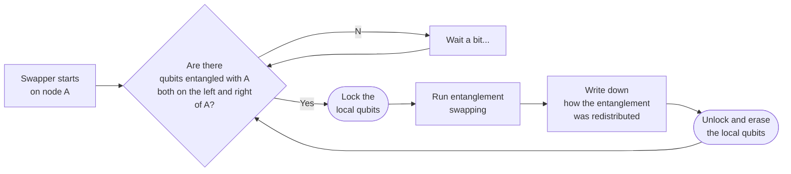
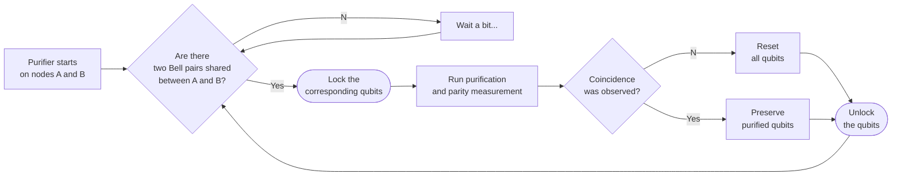

# [First Generation Quantum Repeater](@id First-Generation-Quantum-Repeater)

There is a convenient classification of quantum repeaters by their logical capabilities[^1].
The first, simplest, generation of quantum repeaters involves the generation of physical (unencoded) entangled qubits between neighboring nodes,
followed by entanglement swap and entanglement purification operation.
No error correcting codes are employed and establishing of a link is a probabilistic process.

[^1]: [muralidharan2016optimal](@cite)

We will build a simplistic simulator for such a network.

- We will employ Schroedinger representation (Schroedinger, Lindblad, and other master equation will be used behind the scenes, but we will not need to work at that low level);
- We will consider a chain of quantum repeater nodes of various sizes (number of qubits);
- The goal would be to entangle the extreme ends of the chain:
    - By directly entangling nearest neighbors;
    - Followed by entanglement swaps to extend the links;
    - And entanglement purification to increase the quality of the links.

For organizing the simulation and simplifying the digital and analog quantum dynamics,
we will use the star of `QuantumSavory.jl`, namely the [`Register`](@ref) data structure.
For a convenient data structure to track per-node metadata in a graph (network) we will use the [`RegisterNet`](@ref) structure.

Moreover, behind the scenes `QuantumSavory.jl` will use:

- `ConcurrentSim.jl` for discrete event scheduling and simulation;
- `Makie.jl` together with our custom plotting recipes for visualizations;
- `QuantumOptics.jl` for low-level quantum states.

The user does not need to know much about these libraries, but if they wish, it is easy for them to peek behind the scenes and customize their use.

The full simulation script is available at the bottom.

!!! info "Low Level Implementation"
    This is a very low-level implementation. You would be better of using already implemented reusable protocols like [`EntanglerProt`](https://qs.quantumsavory.org/dev/API_ProtocolZoo/#QuantumSavory.ProtocolZoo.EntanglerProt) like done in the second version of this example [`firstgenrepeater_v2`](https://qs.quantumsavory.org/dev/howto/firstgenrepeater_v2/firstgenrepeater_v2). On the other hand, the setup here is a simple way to learn about making discrete event simulations without depending on a lot of extra library functionality and opaque black boxes.

## The Underlying Data Structures

While the quantum dynamics would be encapsulated in a [`Register`](@ref) data structure,
it is convenient to also set up structures that track the overall topology and events on the network.
Our preferred way to do that is to use the [`RegisterNet`](@ref) structure,
which lets you construct a graph and attach arbitrary meta-data to each edge and vertex.
While this is not required for using `QuantumSavory.jl`, it is convenient,
and we provide a lot of debugging tools that assume the use of this structure.

Given an array of register sizes, e.g. `sizes = [2,3,4,3,2]`, we will create a linear graph,
where each node has the prescribed number of qubits, e.g.:


The `RegisterNet` would contain, on each node:

- a [`Register`](@ref) of the appropriate size;
- an array of tuples keeping track of whom each qubit in the register is entangled to (as the `:enttracker` property);
- an array of locks (from `ConcurrentSim.jl`) keeping track of whether a process is happening on the given qubit (as the `:locks` property).

!!! note
    To see how to visualize these data structures as the simulation is proceeding, consult the [Visualizations](@ref Visualizations) page.

!!! note
    To see how to define imperfections, noise processes, and background events, consult the [Sub-system Background Noise](@ref "Background Noise Processes") page.

```@raw html
<details><summary>Click to expand and see code used to set up the meta-graph and registers</summary>
```
```julia
"""Creates the datastructures representing the simulated network"""
function simulation_setup(
    sizes, # Array giving the number of qubits in each node
    T2 # T2 dephasing times for the qubits
    ;
    representation = QuantumOpticsRepr # Representation to use for the qubits
    )
    R = length(sizes) # Number of registers

    # A scheduler datastructure for the discrete event simulation
    sim = Simulation()

    # All of the quantum register we will be simulating
    registers = Register[]
    for s in sizes
        traits = [Qubit() for _ in 1:s]
        repr = [representation() for _ in 1:s]
        bg = [T2Dephasing(T2) for _ in 1:s]
        push!(registers, Register(traits,repr,bg))
    end

    # A graph structure defining the connectivity among registers
    # It is not necessary to use such a structure, however, it is a convenient way to
    # store data about the simulation (and we have created helper plotting functions
    # expecting such a structure).
    graph = grid([R])
    network = RegisterNet(graph, registers) # A graphs with extra "meta data"

    # Add a register datastructures and event locks to each node.
    for v in vertices(network)
        # Create an array specifying whether a qubit is entangled with another qubit
        network[v,:enttrackers] = Any[nothing for i in 1:sizes[v]]
        # Create an array of locks, telling us whether a qubit is undergoing an operation
        network[v,:locks] = [Resource(sim,1) for i in 1:sizes[v]]
    end

    sim, network
end
```
```@raw html
</details>
```

## Entangler

The first set of processes we need is the "entanglers" that enable nearest-neighbor entanglement generation:

```@raw html
<video src="../firstgenrepeater-02.entangler.mp4" autoplay loop muted></video>
```

They run in parallel on each edge of the graph, set up by an invocation similar to the following:

```julia
for (;src, dst) in edges(network)
    @process entangler(sim, network, src, dst, ...)
end
```

As seen in the following flow chart, the entangler repeatedly checks for available pairs of unused qubit slots and attempts to entangle them.



```@raw html
<details><summary>Click to see the implementation of the Entangler process</summary>
```
```julia
@resumable function entangler(
    sim::Environment,   # The scheduler for all simulation events
    network,            # The graph of quantum nodes
    nodea, nodeb,       # The two nodes which we will be entangling
    noisy_pair,         # A raw entangled pair
    entangler_wait_time,# The wait time in case all qubits are "busy"
    entangler_busy_time # How long it takes to establish entanglement
    )
    while true
        ia = findfreequbit(network, nodea)
        ib = findfreequbit(network, nodeb)
        if isnothing(ia) || isnothing(ib)
            @yield timeout(sim, entangler_wait_time)
            continue
        end
        locka = network[nodea,:locks][ia]
        lockb = network[nodeb,:locks][ib]
        @yield request(locka) & request(lockb)
        registera = network[nodea]
        registerb = network[nodeb]
        @yield timeout(sim, entangler_busy_time)
        initialize!((registera[ia],registerb[ib]),noisy_pair; time=now(sim))
        network[nodea,:enttrackers][ia] = (node=nodeb,slot=ib)
        network[nodeb,:enttrackers][ib] = (node=nodea,slot=ia)
        @simlog sim "entangled node $(nodea):$(ia) and node $(nodeb):$(ib)"
        release(locka)
        release(lockb)
    end
end

"""Find an uninitialized unlocked qubit on a given node"""
function findfreequbit(network, node)
    register = network[node]
    locks = network[node,:locks]
    regsize = nsubsystems(register)
    findfirst(i->!isassigned(register,i) & isfree(locks[i]), 1:regsize)
end
```
```@raw html
</details>
```

Notice that the entangler uses the [`initialize!`](@ref) function to set the state of certain registers, but we never need to explicitly construct the numerical representation of these kets. Rather, we use the symbolic algebra system of [`QuantumSymbolics.jl`](https://github.com/QuantumSavory/QuantumSymbolics.jl), and let the simulator automatically convert the symbolic expression into numerical density matrices. This conversion was governed by the choice of `representation = QuantumOpticsRepr`. Here is one possible symbolic definition of a `noisy_pair`:

```julia
const perfect_pair = (Z1⊗Z1 + Z2⊗Z2) / sqrt(2)
const perfect_pair_dm = SProjector(perfect_pair)
const mixed_dm = MixedState(perfect_pair_dm)
noisy_pair_func(F) = F*perfect_pair_dm + (1-F)*mixed_dm
```

The symbolic-expression-to-density-matrix conversion is cached inside of the symbolic expression, so that it does not need to be recomputed each time.

## Swapper

Once we have the raw nearest-neighbor entanglement, we can proceed with swap operations that link two Bell pairs that share one common node into a longer Bell pair:

```@raw html
<video src="../firstgenrepeater-03.swapper.mp4" autoplay loop muted></video>
```

They run in parallel on each vertex of the graph, set up by an invocation similar to the following:

```julia
for node in vertices(network)
    @process swapper(sim, network, node, ...)
end
```

The Swapper working on a given node simply checks whether there are any qubits on that node
that are entangled with other nodes, both on the left and right of the current node.
If such qubits are found, the entanglement swap operation is performed on them, as seen in this flowchart.



The entanglement swap operation is performed through the following simple circuit, which entangles the two local qubits belonging to two separate Bell pairs, and then measures them:

```@raw html

<!--
[Initialize("pair 1", [1, 2]),
 Initialize("pair 2", [3, 4]),
 CNOT(2, 3),
 Measurement("X", 2, 1),
 ClassicalDecision("Z", 1, 1),
 Measurement("Z", 3, 2),
 ClassicalDecision("X", 4, 2)]
 -->
```

The code implementing such a circuit looks like the following (where `localslot` denotes register slots on which swapping happens, and `remslot` denotes remote registers on the left and right):

```julia
apply!((localslot1, localslot2), CNOT; time=time)
xmeas = project_traceout!(localslot1, X)
zmeas = project_traceout!(localslot2, Z)
if xmeas==2
    apply!(remslot1, Z)
end
if zmeas==2
    apply!(remslot2, X)
end
```

```@raw html
<details><summary>Click to see the implementation of the Swapper process</summary>
```
```julia
@resumable function swapper(
    sim::Environment, # The scheduler for all simulation events
    network,          # The graph of quantum nodes
    node,             # The node on which the swapper works
    swapper_wait_time,# The wait time in case there are no available qubits for swapping
    swapper_busy_time # How long it takes to perform the swap
    )
    while true
        qubit_pair = findswapablequbits(network,node)
        if isnothing(qubit_pair)
            @yield timeout(sim, swapper_wait_time)
            continue
        end
        q1, q2 = qubit_pair
        locks = network[node, :locks][[q1,q2]]
        @yield mapreduce(request, &, locks)
        reg = network[node]
        @yield timeout(sim, swapper_busy_time)
        node1 = network[node,:enttrackers][q1]
        reg1 = network[node1.node]
        node2 = network[node,:enttrackers][q2]
        reg2 = network[node2.node]
        swapcircuit(reg[q1], reg[q2], reg1[node1.slot], reg2[node2.slot]; time=now(sim))
        network[node1.node,:enttrackers][node1.slot] = node2
        network[node2.node,:enttrackers][node2.slot] = node1
        network[node,:enttrackers][q1] = nothing
        network[node,:enttrackers][q2] = nothing
        @simlog sim "swap at $(node):$(q1)&$(q2) connecting $(node1) and $(node2)"
        release.(locks)
    end
end

function swapcircuit(localslot1, localslot2, remslot1, remslot2; time=nothing)
    apply!((localslot1, localslot2), CNOT; time=time)
    xmeas = project_traceout!(localslot1, X)
    zmeas = project_traceout!(localslot2, Z)
    if xmeas==2
        apply!(remslot1, Z)
    end
    if zmeas==2
        apply!(remslot2, X)
    end
end

function findswapablequbits(network,node)
    enttrackers = network[node,:enttrackers]
    locks = network[node,:locks]
    left_nodes  = [(i=i,n...) for (i,n) in enumerate(enttrackers)
                   if !isnothing(n) && n.node<node && isfree(locks[i])]
    isempty(left_nodes)  && return nothing
    right_nodes = [(i=i,n...) for (i,n) in enumerate(enttrackers)
                   if !isnothing(n) && n.node>node && isfree(locks[i])]
    isempty(right_nodes) && return nothing
    _, farthest_left  = findmin(n->n.node, left_nodes)
    _, farthest_right = findmax(n->n.node, right_nodes)
    return left_nodes[farthest_left].i, right_nodes[farthest_right].i
end
```
```@raw html
</details>
```

## Purifier

Last but not least, there is the Purifier that searches for pairs of nodes that share more than one Bell pair.
On such nodes a purification procedure can be performed:

```@raw html
<video src="../firstgenrepeater-05.purifier.mp4" autoplay loop muted></video>
```

As you can see, not all purification attempts succeed. On some occasions there is a failure and both pairs get discarded as faulty.
Each Purifier is running two purification circuits, one after the other,
as a single round of purification is incapable of detecting all types of errors.
The two circuits being employed are the following:

```@raw html


<!--
[Initialize("pair 1", [1, 2]),
 Initialize("pair 2", [3, 4]),
 CNOT(1, 3),
 CNOT(2, 4),
 Measurement("X", 1),
 Measurement("X", 2)]
[Initialize("pair 1", [1, 2]),
 Initialize("pair 2", [3, 4]),
 CPHASE(1, 3),
 CPHASE(2, 4),
 Measurement("X", 1),
 Measurement("X", 2)]
-->
```

If the coincidence measurements fail, all qubits are reset.
If the coincidence measurements are correct, the purified pair would have higher fidelity than what it started with.
To implement one of these circuits one can write something akin to the following, where `regA` and `regB` are the two registers who share two entangled pairs, and `pairXqubitX` specifies the slot for each of the qubits of each of the pairs:

```julia
gate = Gates.CNOT # or Gates.CPHASE
apply!((rega[pair2qa],rega[pair1qa]),gate)
apply!((regb[pair2qb],regb[pair1qb]),gate)
measa = project_traceout!(rega[pair2qa], X)
measb = project_traceout!(regb[pair2qb], X)
if measa!=measb
    traceout!(rega[pair1qa])
    traceout!(regb[pair1qb])
end
```

The overall structure of this process is similar to the Entangler and Swapper: repeatedly trying to lock four qubits belonging to two pairs shared by the same nodes, followed by performing the purification procedure.



Purification processes are started on all pairs of nodes with an invocation like:
```julia
for nodea in vertices(network)
    for nodeb in vertices(network)
        if nodeb>nodea
            @process purifier(sim, network, nodea, nodeb, ...)
        end
    end
end
```

```@raw html
<details><summary>Click to see the implementation of the Entangler process</summary>
```
```julia
@resumable function purifier(
    sim::Environment,  # The scheduler for all simulation events
    network,           # The graph of quantum nodes
    nodea,             # One of the nodes on which the pairs to be purified rest
    nodeb,             # The other such node
    purifier_wait_time,# The wait time in case there are no pairs available for purification
    purifier_busy_time # The duration of the purification circuit
    )
    round = 0
    while true
        pairs_of_bellpairs = findqubitstopurify(network,nodea,nodeb)
        if isnothing(pairs_of_bellpairs)
            @yield timeout(sim, purifier_wait_time)
            continue
        end
        pair1qa, pair1qb, pair2qa, pair2qb = pairs_of_bellpairs
        locks = [network[nodea,:locks][[pair1qa,pair2qa]];
                 network[nodeb,:locks][[pair1qb,pair2qb]]]
        @yield mapreduce(request, &, locks)
        @yield timeout(sim, purifier_busy_time)
        rega = network[nodea]
        regb = network[nodeb]
        gate = (CNOT, CPHASE)[round%2+1]
        apply!((rega[pair2qa],rega[pair1qa]),gate)
        apply!((regb[pair2qb],regb[pair1qb]),gate)
        measa = project_traceout!(rega[pair2qa], X)
        measb = project_traceout!(regb[pair2qb], X)
        if measa!=measb
            traceout!(rega[pair1qa])
            traceout!(regb[pair1qb])
            network[nodea,:enttrackers][pair1qa] = nothing
            network[nodeb,:enttrackers][pair1qb] = nothing
            @simlog sim "failed purification at $(nodea):$(pair1qa)&$(pair2qa) and $(nodeb):$(pair1qb)&$(pair2qb)"
        else
            round += 1
            @simlog sim "purification at $(nodea):$(pair1qa) $(nodeb):$(pair1qb) by sacrifice of $(nodea):$(pair1qa) $(nodeb):$(pair1qb)"
        end
        network[nodea,:enttrackers][pair2qa] = nothing
        network[nodeb,:enttrackers][pair2qb] = nothing
        release.(locks)
    end
end

function findqubitstopurify(network,nodea,nodeb)
    enttrackers = network[nodea,:enttrackers]
    locksa = network[nodea,:locks]
    locksb = network[nodeb,:locks]
    enttrackers = [(i=i,n...) for (i,n) in enumerate(enttrackers)
                   if !isnothing(n) && n.node==nodeb && isfree(locksa[i]) && isfree(locksb[n.slot])]
    if length(enttrackers)>=2
        aqubits = [n.i for n in enttrackers[end-1:end]]
        bqubits = [n.slot for n in enttrackers[end-1:end]]
        return aqubits[2], bqubits[2], aqubits[1], bqubits[1]
    else
        return nothing
    end
end
```
```@raw html
</details>
```

## Running the simulations

Now that we have defined the Entangler, Swapper, and Purifier processes, we just need to run the simulation.
That is no different from running any other `ConcurrentSim.jl` simulation, after our custom setup:

```julia
sizes = [2,3,4,3,2]        # Number of qubits in each register
T2 = 100.0                 # T2 dephasing time of all qubits
F = 0.97                   # Fidelity of the raw Bell pairs
entangler_wait_time = 0.1  # How long to wait if all qubits are busy before retrying entangling
entangler_busy_time = 1.0  # How long it takes to establish a newly entangled pair
swapper_wait_time = 0.1    # How long to wait if all qubits are unavailable for swapping
swapper_busy_time = 0.15   # How long it takes to swap two qubits
purifier_wait_time = 0.15  # How long to wait if there are no pairs to be purified
purifier_busy_time = 0.2   # How long the purification circuit takes to execute

sim, network = simulation_setup(sizes, T2; representation = CliffordRepr)

noisy_pair = stab_noisy_pair_func(F)
for (;src, dst) in edges(network)
    @process entangler(sim, network, src, dst, noisy_pair, entangler_wait_time, entangler_busy_time)
end
for node in vertices(network)
    @process swapper(sim, network, node, swapper_wait_time, swapper_busy_time)
end
for nodea in vertices(network)
    for nodeb in vertices(network)
        if nodeb>nodea
            @process purifier(sim, network, nodea, nodeb, purifier_wait_time, purifier_busy_time)
        end
    end
end
```

Then to run the simulation up to time `t` we just write `run(sim, t)`.
If we want to run until the next event, whenever that is, we can do `ConcurrentSim.step(sim)`

## Figures of Merit and Visualizations

These simulations are not particularly useful if we do not track the performance of the quantum network.
One convenient way to do that is to compute observables related to the quality of entanglement,
e.g., the `XX` and `ZZ` correlators.
We will compute these correlators for the second pair on the extreme ends of the chain of repeaters:

```@raw html
<video src="../firstgenrepeater-07.observable.mp4" autoplay loop muted></video>
```

Notice how the `XX` observable drops due to the T₂ dephasing experienced by the qubits.
And then it goes back up at the occurrence of a successful purification
(or all the way to zero at failed purifications).
Here is what it looks like if we do not perform purification:

```@raw html
<video src="../firstgenrepeater-07.observable.nopur.mp4" autoplay loop muted></video>
```

The plotting itself is realized with the wonderful `Makie.jl` plotting library.
The figure of merrit is obtained through a call to [`observable`](@ref),
a convenient method for calculating expectation values of various quantum observables.

## Summary of `QuantumSavory` tools employed in the simulation

We used the [`Register`](@ref) data structure to automatically track the quantum states
describing our mixed analog-digital quantum dynamics.

Much of the analog dynamics was implicit through the use of [backgrounds,
declaring the noise properties of various qubits](@ref "Background Noise Processes").

The digital-ish dynamics was implemented through the use of
- [`initialize!`](@ref) for setting initial states to various qubits
- [`apply!`](@ref) for the application of various gates
- [`traceout!`](@ref) for deleting qubits
- [`project_traceout!`](@ref) for projective measurements over qubits
- [`observable`](@ref) for calculating expectation values of quantum observables

Many of the above functions take the `time` keyword argument, which ensures that various background analog processes are simulated before the given operation is performed.

Of note is that we also used
`Makie.jl` for plotting,
`ConcurrentSim.jl` for discrete event scheduling,
`QuantumClifford.jl` for efficient simulation of Clifford circuits,
and `QuantumOptics.jl` for convenient master equation integration.
Many of these tools were used under the hood without being invoked directly.

## Suggested Improvements

- The first and most obvious improvement would be to trigger the various events (Entangler, Swapper, Purifier) from each other, instead of having them all randomly wait and hope the necessary resources are available.
- Calibrating when to perform a purification versus a swap would be important for the performance of the network.
- Balancing what types of entanglement purification is performed, depending on the type of noise experienced, can drastically lower resource requirements.
- Implementing more sophisticated purification schemes can greatly improve the quality of entanglement.


The source code is in the [`examples/firstgenrepeater`](https://github.com/QuantumSavory/QuantumSavory.jl/tree/master/examples/firstgenrepeater) folder.