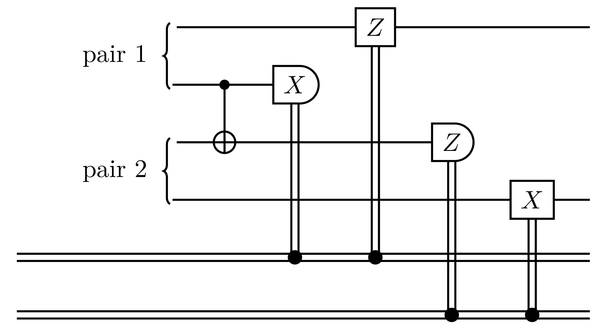
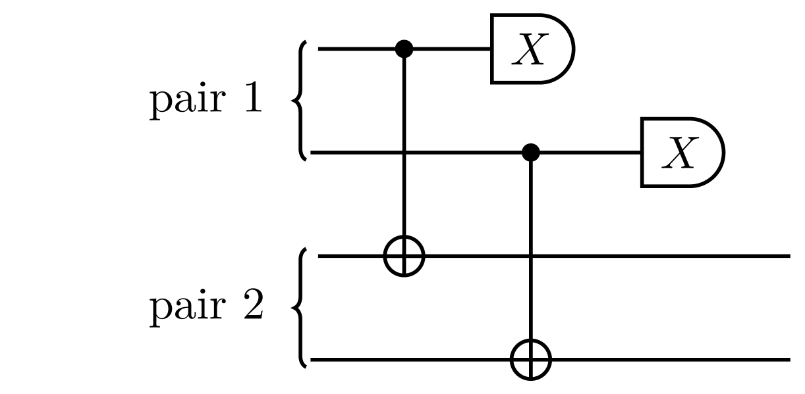
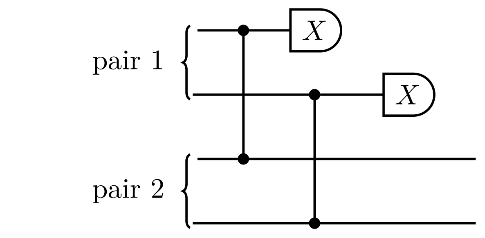

# [First Generation Quantum Repeater](@id First-Generation-Quantum-Repeater-ProtocolZoo)

This how-to guide walks through a simulation of a first-generation quantum repeater chain
using the high-level protocol abstractions from [`QuantumSavory.ProtocolZoo`](@ref "Predefined Networking Protocols").

There is a convenient classification of quantum repeaters by their logical capabilities[^1].
The first, simplest, generation of quantum repeaters involves the generation of physical (unencoded) entangled qubits between neighboring nodes,
followed by entanglement swap and entanglement purification operation.
No error correcting codes are employed and establishing of a link is a probabilistic process.

[^1]: [muralidharan2016optimal](@cite)

!!! info "A lower-level version is also available"
    Compared to [the lower-level implementation](@ref First-Generation-Quantum-Repeater),
    the code here is drastically shorter because the entangler and swapper are provided as
    ready-made reusable protocols.
    If you want to understand what is happening inside these protocols, or if you want to
    write your own from scratch, you can check out the low-level version.

The simulated network is a chain of quantum repeater nodes of various sizes (number of qubits).
The goal is to entangle the extreme ends of the chain:

- By directly entangling nearest neighbors, done probabilistically by an [`EntanglerProt`](@ref);
- Followed by entanglement swaps to extend the links, performed by a [`SwapperProt`](@ref) running on every intermediate node;
- And entanglement purification to increase the quality of the links, done here by a custom purifier process whenever two Bell pairs are shared between the same node pair.

Classical metadata (who is entangled with whom) is kept consistent across the network by an [`EntanglementTracker`](@ref),
so that, unlike in the low-level version, the bookkeeping never has to be done by hand.

Behind the scenes `QuantumSavory.jl` will use:

- `ConcurrentSim.jl` for discrete event scheduling and simulation;
- `Makie.jl` together with our custom plotting recipes for visualizations;
- `QuantumOptics.jl` for low-level quantum states.

The user does not need to know much about these libraries, but if they wish, it is easy for them to peek behind the scenes and customize their use.

The source code is in the [`examples/firstgenrepeater`](https://github.com/QuantumSavory/QuantumSavory.jl/tree/master/examples/firstgenrepeater) folder.

## Network Setup

The network is the same linear graph used in the low-level example.
Given an array of register sizes (e.g. `sizes = [2,3,4,3,2]`) and a T₂ dephasing time,
`simulation_setup` creates a [`RegisterNet`](@ref) — a graph where each vertex holds a [`Register`](@ref) and a shared discrete-event scheduler:

```julia
sim, network = simulation_setup(sizes, T2)
```

Each qubit is assigned a [`T2Dephasing`](@ref) background process so that stored entanglement decays naturally without any explicit tracking.

!!! note
    To see how to visualize these data structures as the simulation is proceeding, consult the [Visualizations](@ref Visualizations) page.

!!! note
    To see how to define imperfections, noise processes, and background events, consult the [Sub-system Background Noise](@ref "Background Noise Processes") page.

## Entangler

[`EntanglerProt`](@ref) is a pre-built process that continuously tries to establish a Bell pair between two neighboring nodes.
One instance runs on every edge of the network:

```julia
for (; src, dst) in edges(network)
    eprot = EntanglerProt(sim, network, src, dst; pairstate = noisy_pair, ...)
    @process eprot()
end
```

```@raw html
<video src="../firstgenrepeater-01.entangler.mp4" autoplay loop muted></video>
```

Internally it searches for a free qubit slot on each endpoint, locks them, waits for the
entanglement attempt, and writes the result into the register using the tag system.
All of that bookkeeping is hidden behind the protocol — compare with the
[manual entangler implementation](@ref First-Generation-Quantum-Repeater) to see
what is being abstracted away.

The `pairstate` argument accepts any symbolic or numerical two-qubit state.
Here we use [`BarrettKokBellPair`](@ref) from [`StatesZoo`](@ref Predefined-Models-of-Quantum-States),
a physically motivated noisy Bell state parametrized by the optical channel efficiencies and dark-count probability of the Barrett-Kok scheme:

```julia
pairstate = BarrettKokBellPair(ηᴬ, ηᴮ, Pᵈ, ηᵈ, 𝒱)
```

## Swapper

Once we have the raw nearest-neighbor entanglement, we can proceed with swap operations that link two Bell pairs that share one common node into a longer Bell pair.
The swapper working on a given node simply checks whether there are any qubits on that node that are entangled with other nodes, both on the left and right of the current node.
If such qubits are found, the entanglement swap operation is performed on them.

The entanglement swap operation is performed through the following simple circuit, which entangles the two local qubits belonging to two separate Bell pairs, and then measures them:

```@raw html

```

The two measurement outcomes determine which Pauli corrections (a `Z` and an `X`) are applied to the remote qubits of the now-connected long-range pair.

[`SwapperProt`](@ref) performs exactly this Bell measurement on local qubits that are each half of a separate Bell pair.
One instance runs on every node:

```julia
for node in vertices(network)
    sprot = SwapperProt(
        sim, network, node;
        nodeL = <(node), nodeH = >(node),
        chooseL = argmin, chooseH = argmax,
        ...
    )
    @process sprot()
end
```

```@raw html
<video src="../firstgenrepeater-02.swapper.mp4" autoplay loop muted></video>
```

The `nodeL`/`nodeH` predicates tell the swapper which nodes count as "left" and "right"
neighbours respectively.
`chooseL = argmin` and `chooseH = argmax` instruct it to prefer swapping with the
farthest available neighbour on each side, which maximises the reach of the resulting long-range link.

The second example script (`2_swapper_example.jl`) runs this same setup as an interactive web app built with WGLMakie and Bonito, with sliders to adjust both the network parameters and the Barrett-Kok source parameters in real time.
The video above was recorded from that live demo.

## Entanglement Tracker

After a swap, the two remote endpoints of the newly created long-range link need to be
informed about their new counterpart so that they can coordinate future operations.
[`EntanglementTracker`](@ref) handles all of this classical messaging automatically:

```julia
for node in vertices(network)
    @process EntanglementTracker(sim, network, node)()
end
```

Without it, the metadata stored on each node's register would become stale after swaps,
and the purifier (or any other consumer of entanglement) would not be able to locate its pairs correctly.
In the low-level example this bookkeeping was done by hand inside the swapper loop;
here it is a separate, reusable process.

## Purifier

The purifier is the one protocol that is still written by hand in this example,
to illustrate how simple it is to build a custom process on top of the ProtocolZoo infrastructure.
It searches for any two Bell pairs shared between the same pair of nodes and
distills them into a single higher-fidelity pair:

```@raw html
<video src="../firstgenrepeater-03.purifier.mp4" autoplay loop muted></video>
```

As you can see, not all purification attempts succeed. On some occasions there is a failure and both pairs get discarded as faulty.
Each purifier runs two purification circuits, one after the other,
as a single round of purification is incapable of detecting all types of errors.
The two circuits being employed are the following:

```@raw html


```

If the coincidence measurements fail, all qubits are reset.
If the coincidence measurements are correct, the purified pair would have higher fidelity than what it started with.
In the code below this two-round structure is captured by alternating the `purifyerror` between `:X` and `:Z` on successive successful rounds:

```julia
@resumable function purifier(sim, network, nodea, nodeb,
                              purifier_wait_time, purifier_busy_time)
    nround = 0
    while true
        pairs_of_bellpairs = findqubitstopurify(network, nodea, nodeb)
        if isnothing(pairs_of_bellpairs)
            @yield timeout(sim, purifier_wait_time)
            continue
        end
        qa1, qa2, qb1, qb2 = pairs_of_bellpairs
        @yield lock(qa1.slot) & lock(qa2.slot) & lock(qb1.slot) & lock(qb2.slot)
        @yield timeout(sim, purifier_busy_time)
        purifyerror = (:X, :Z)[nround % 2 + 1]
        success = Purify2to1(purifyerror)(qa1.slot, qb1.slot, qa2.slot, qb2.slot)
        if success
            nround += 1
        end
        untag!(qa2.slot, qa2.id)
        untag!(qb2.slot, qb2.id)
        unlock(qa1.slot); unlock(qa2.slot); unlock(qb1.slot); unlock(qb2.slot)
    end
end
```

The key difference from the low-level purifier is the use of the **tag system**:
`queryall` and `query` find qubits by their [`EntanglementCounterpart`](@ref) tag rather than by manually inspecting `:enttrackers` arrays,
and `untag!` removes the tag from consumed qubits rather than writing `nothing` into tracker arrays.

Purifiers are started on every pair of nodes:

```julia
for nodea in vertices(network), nodeb in vertices(network)
    nodeb > nodea && @process purifier(sim, network, nodea, nodeb, ...)
end
```

## Running the Simulation

Once all processes are registered the simulation is advanced with `run(sim, t)`:

```julia
sizes = [2, 3, 4, 3, 2]
T2 = 10.0
sim, network = simulation_setup(sizes, T2)

# start all protocol processes ...

step_ts = range(0, 30, step = 0.1)
for t in step_ts
    run(sim, t)
    notify(obs)
end
```

The three scripts in the `examples/firstgenrepeater` folder build on top of each other:

1. **`1_entangler_example.jl`** — entanglement generation only, no swaps or purification;
2. **`2_swapper_example.jl`** — entanglement generation and swapping, as an interactive web app with Barrett-Kok source sliders;
3. **`3_purifier_example.jl`** — all three layers running together.

## Figures of Merit and Visualizations

These simulations are not particularly useful if we do not track the performance of the quantum network.
One convenient way to do that is to compute observables related to the quality of entanglement,
e.g., the `XX` and `ZZ` correlators.
We compute these correlators for the second pair on the extreme ends of the chain of repeaters:

```@raw html
<video src="../firstgenrepeater_lowlevel/firstgenrepeater-07.observable.mp4" autoplay loop muted></video>
```

Notice how the `XX` observable drops due to the T₂ dephasing experienced by the qubits.
And then it goes back up at the occurrence of a successful purification
(or all the way to zero at failed purifications).
Here is what it looks like if we do not perform purification:

```@raw html
<video src="../firstgenrepeater_lowlevel/firstgenrepeater-07.observable.nopur.mp4" autoplay loop muted></video>
```

The plotting itself is realized with the wonderful `Makie.jl` plotting library.
The figure of merit is obtained through a call to [`observable`](@ref),
a convenient method for calculating expectation values of various quantum observables.

## Summary of `QuantumSavory` tools employed in the simulation

We used the [`Register`](@ref) data structure to automatically track the quantum states
describing our mixed analog-digital quantum dynamics.

Much of the analog dynamics was implicit through the use of [backgrounds,
declaring the noise properties of various qubits](@ref "Background Noise Processes").

On top of that, the high-level protocols from [`QuantumSavory.ProtocolZoo`](@ref "Predefined Networking Protocols")
([`EntanglerProt`](@ref), [`SwapperProt`](@ref), and [`EntanglementTracker`](@ref))
took care of the entangling, swapping, and classical bookkeeping that the low-level example implemented by hand,
while the digital-ish dynamics of the custom purifier was implemented through the use of
- [`apply!`](@ref) for the application of various gates
- [`traceout!`](@ref) for deleting qubits
- [`project_traceout!`](@ref) for projective measurements over qubits
- [`observable`](@ref) for calculating expectation values of quantum observables

Many of the above functions take the `time` keyword argument, which ensures that various background analog processes are simulated before the given operation is performed.

Of note is that we also used
`Makie.jl` for plotting,
`ConcurrentSim.jl` for discrete event scheduling,
and `QuantumOptics.jl` for convenient master equation integration.
Many of these tools were used under the hood without being invoked directly.

## Suggested Improvements

- Calibrating when to perform a purification versus a swap would be important for the performance of the network.
- Balancing what types of entanglement purification is performed, depending on the type of noise experienced, can drastically lower resource requirements.
- Implementing more sophisticated purification schemes can greatly improve the quality of entanglement.

