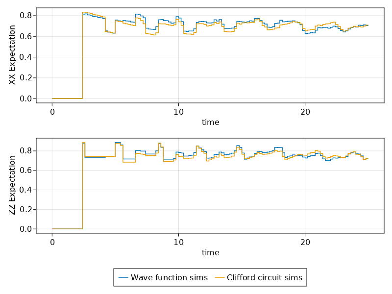

# Clifford Simulations of First Generation Quantum Repeater

Here we will simulate a quantum repeater by employing a noisy Clifford circuit simulator.

Be sure to check out the more detailed tutorial on [wavefunction simulations of First Generation Quantum Repeater](@ref First-Generation-Quantum-Repeater) before proceeding with this one.

!!! warning "Low Level Implementation"
    This is a very low-level implementation, mainly useful for learning how to make simulations from scratch. For a more practical example that does the same thing with much less code thanks to already implemented reusable protocols like [`EntanglerProt`](https://qs.quantumsavory.org/dev/API_ProtocolZoo/#QuantumSavory.ProtocolZoo.EntanglerProt), see the higher-level [`firstgenrepeater`](https://qs.quantumsavory.org/dev/howto/firstgenrepeater/firstgenrepeater) example.

The changes we need to perform to the code are incredibly small. We only change the way the initial states of the entangled pairs are set, without changing any of the code implementing the swapping and purification steps.

For the wavefunction simulator we had set up a few symbolic building blocks and drawn the raw pair from `StatesZoo`:

```julia
const perfect_pair = (Z1⊗Z1 + Z2⊗Z2) / sqrt(2)
const perfect_pair_dm = SProjector(perfect_pair)
const mixed_dm = MixedState(perfect_pair_dm)
noisy_pair_func(F) = DepolarizedBellPair(;F)
function manual_noisy_pair_func(F)
    p = (4F - 1) / 3
    p*perfect_pair_dm + (1-p)*mixed_dm
end
```

Here we switch to tableau representation for our initial states.
Converting from tableaux to kets or density matrices is cheap and automated,
but the reverse direction is difficult, thus we give the initial state explicitly.
You can actually use the tableau definition below for all types of simulations (tableau, ket, others).

```julia
# a tableau corresponding to a Bell pair
const stab_perfect_pair = StabilizerState("XX ZZ")
const stab_perfect_pair_dm = SProjector(stab_perfect_pair)
function stab_noisy_pair_func(F)
    p = (4F - 1) / 3
    p*stab_perfect_pair_dm + (1-p)*mixed_dm
end
```

The overlap of `mixed_dm = I/4` with the Bell projector is `1/4`, so
the Bell-projector weight is `p = (4F-1)/3`, not `F`. This formula applies for
Bell fidelities `1/4 ≤ F ≤ 1`.

We then use that in the entangler setup (the same way we used a similar function when we were doing wavefunction simulations), simply by selecting the appropriate default representation type ([`CliffordRepr`](@ref) instead of [`QuantumOpticsRepr`](@ref)):

```julia
# excerpt from `5_clifford_full_example.jl`
sim, network = simulation_setup(sizes, T2; representation = CliffordRepr)
noisy_pair = stab_noisy_pair_func(F)
```

The symbolic conversion is cached inside `noisy_pair`. For a Clifford register,
this convex sum samples one tableau at each initialization. Supported Clifford
background noise likewise samples trajectory events. A single run is therefore
one trajectory; estimate an ensemble fidelity curve from multiple independent
runs and average their results. Some rank-deficient mixed stabilizer states can
be represented exactly by a mixed tableau, so this sampling statement applies
to the convex sum and noise model used here, not to every mixed Clifford state.

!!! note "Background parameters"
    This example configures every slot with `T2Dephasing(T2)`. A separate
    variable named `T1` has no effect unless it is used to construct the slot
    background. See [Background Noise Processes](@ref) for backend support when
    both T1 and T2 are needed.

!!! note "You can use tableaux states in the Schroedinger simulations."

    Converting from tableaux to kets or density matrices is cheap and automated, so we could have just as well used `stab_noisy_pair_func` even with the Schroedinger simulations of `QuantumOpticsRepr`.

## Simulation Trace

Similarly to the wavefunction simulations from the previous tutorial, here we can see how the various observables evolve over time for a Clifford-base simulation. Notice that unlike the wavefunction simulation, the results are very discrete. The comparison below therefore averages multiple independent trajectories.

```@raw html
<video src="../firstgenrepeater-08.clifford.mp4" autoplay loop muted></video>
```

## Comparison Against a Wavefunction-based Simulations

We can run the either simulation multiple times in order to compare the results from the wavefunction and tableau-based simulations:




The source code is in the [`examples/firstgenrepeater`](https://github.com/QuantumSavory/QuantumSavory.jl/tree/master/examples/firstgenrepeater) folder.
