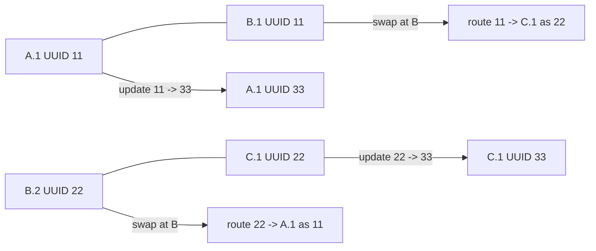

# UUID Entanglement Tracking

This how-to demonstrates the UUID-based entanglement tracking protocol path:
`EntanglerProtUUID`, `SwapperProtUUID`, and `EntanglementTrackerUUID`.

The existing tracker uses remote node/slot history tags to route delayed update
messages. The UUID tracker instead addresses update and delete messages to a
Bell-pair identity. When a swap consumes a local qubit, the measured slot keeps
a route from old UUIDs to the node that now owns the logical qubit.



The small comparison example runs the UUID tracker and the history tracker on
the same three-node chain:

```bash
julia --project=examples examples/uuid_entanglement_tracking/setup.jl
```

The UUID path is intentionally not a drop-in replacement for every protocol. It
is a second protocol stack that composes through the same register, tag, lock,
and message-buffer APIs. The route tags are what make the design robust against
the stale-message case where a swapper slot has already been measured out and
then reused for a fresh Bell pair.

## Running A Chain

```julia
using ConcurrentSim
using Graphs
using QuantumSavory
using QuantumSavory.ProtocolZoo

net = RegisterNet([Register(1), Register(2), Register(1)]; classical_delay=1e-9)
sim = get_time_tracker(net)

for node in vertices(net)
    @process EntanglementTrackerUUID(net, node)()
end

@process EntanglerProtUUID(net, 1, 2; success_prob=1.0, rounds=1, chooseslotA=1, chooseslotB=1)()
@process EntanglerProtUUID(net, 2, 3; success_prob=1.0, rounds=1, chooseslotA=2, chooseslotB=1)()
run(sim, 1.0)

@process SwapperProtUUID(net, 2; nodeL=1, nodeH=3, rounds=1)()
run(sim, 2.0)
```

After the swap, nodes 1 and 3 should have matching `EntanglementUUID` tags and
the intermediate node should only retain route metadata for stale messages.

## Comparison To History Tags

The history tracker records enough node/slot history to translate update
messages after a swap. The UUID tracker stores less topological detail in each
message, but it keeps alias and route records keyed by UUID:

- `EntanglementUUID` is the live tag on a qubit.
- `EntanglementUUIDAlias` maps earlier UUIDs to the current live UUID.
- `EntanglementUUIDRoute` forwards late messages from a measured-out swapper
  slot to the node currently responsible for the logical qubit.

This directly targets the class of bugs where a late update should refer to an
old Bell pair, while the old physical slot has already been reused for a new
pair.
