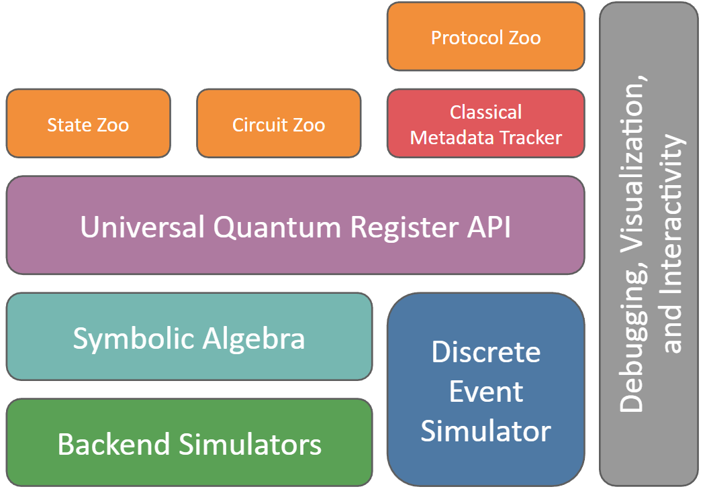

# QuantumSavory.jl

```@meta
DocTestSetup = quote
    using QuantumSavory
end
```

A multi-formalism simulator for noisy quantum communication and computation
hardware, with support for symbolic algebra, multiple simulation backends,
noise models, discrete-event simulation, optimization, and visualization.



The architecture centers on a single register interface that connects symbolic
modeling, numerical backends, protocol control, and reusable building blocks.
The main productivity gain is simple: you describe the physics once in a
symbolic language, then reuse that model across different simulation backends
instead of rewriting it for each formalism. That makes it much easier to build
digital twins and compare modeling assumptions without starting over.
If you want the full mental model behind that separation of concerns, start
with [Architecture and Mental Model](@ref architecture).

## Start Here

If this is your first visit, the shortest path is:

1. Install the package with `pkg> add QuantumSavory`.
2. Work through the [Getting Started Manual](@ref manual).
3. Continue into [Explanations](@ref), [Tutorials](@ref), [How-To Guides](@ref),
   or [References](@ref), depending on what you need next.

## Documentation Map

- [Getting Started Manual](@ref manual): a first guided simulation.
- [Explanations](@ref): architecture, conventions, and the conceptual model.
- [Tutorials](@ref): focused lessons on one feature at a time.
- [How-To Guides](@ref): larger task-oriented workflows.
- [References](@ref): API lookup and generated module documentation.

## Capabilities

QuantumSavory is particularly useful when you need to study a system across
multiple abstraction layers at once: hardware noise, heterogeneous physical
subsystems, algorithmic structure, and distributed classical control. This is
the situation where many models become slow to build and hard to change. The
main value of QuantumSavory is that it reduces that friction. This matters in
exactly the common case where a study starts with an idealized qubit model and
later needs a memory model, a photonic mode, a continuous-variable subsystem,
or a faster restricted approximation.

- symbolic descriptions of states, operations, and observables:
  you describe the intended physics once, in backend-agnostic language, instead
  of hand-writing tableaux, wavefunctions, phase-space objects, or other
  backend-specific mathematics; this lets you work productively even when the
  right backend uses math you would not want to write by hand
- interchangeable numerical backends:
  the same model can be executed with fast specialized methods when they apply,
  and the library is not limited to ideal qubit-only models; it can support
  quantum modes, multi-level systems, continuous-variable models, and other
  physically realistic subsystems; this makes it practical to compare accuracy,
  speed, and physical realism without rebuilding the simulation
- declarative noise models and automatic time handling:
  you specify what noise processes exist and when protocol events happen, while
  QuantumSavory handles the bookkeeping of evolving those effects in the chosen
  representation instead of making you manually derive the backend-specific form
  of each noise process; this keeps physical detail from turning into repetitive
  simulator-specific glue code
- classical control for LOCC-style protocols through a structured metadata API:
  protocols coordinate by publishing and querying semantic facts about resources
  and messages, which makes them compose in a lego-like way without bespoke
  manual piping of classical message channels; this makes larger protocol stacks
  easier to extend and reuse
- visualization of states, metadata, and protocol state:
  the same abstractions used for simulation can also be inspected and debugged
  visually while developing larger models

## Example Applications

Below we show some of the results of the How-To guides.

#### A simulation of a quantum repeater:

```@raw html
<video src="howto/firstgenrepeater/firstgenrepeater-07.observable.mp4" autoplay loop muted></video>
```

#### A simulation of the generation of a cluster state in color-center memories:

```@raw html
<video src="howto/colorcentermodularcluster/colorcentermodularcluster-02.simdashboard.mp4" autoplay loop muted></video>
```

For a first runnable example, start with the [Getting Started Manual](@ref manual).

## Office Hours

Office hours are held every Friday from 12:30 – 1:30 PM Eastern Time via [Zoom](https://umass-amherst.zoom.us/j/95986275946?pwd=6h7Wbai1bXIai0XQsatNRWaVbQlTDr.1). Before joining, make sure to check the [Julia community events calendar](https://julialang.org/community/#events) to confirm whether office hours are happening, rescheduled, or canceled for the week. Feel free to bring any questions or suggestions!

## Support

QuantumSavory.jl is developed by [many volunteers](https://github.com/QuantumSavory/QuantumSavory.jl/graphs/contributors), managed at [Prof. Krastanov's lab](https://lab.krastanov.org/) at [University of Massachusetts Amherst](https://www.umass.edu/quantum/).

The development effort is supported by The [NSF Engineering and Research Center for Quantum Networks](https://cqn-erc.arizona.edu/), and
by NSF Grant 2346089 "Research Infrastructure: CIRC: New: Full-stack Codesign Tools for Quantum Hardware".

## Bounties

[We run many bug bounties and encourage submissions from novices (we are happy to help onboard you in the field).](https://github.com/QuantumSavory/.github/blob/main/BUG_BOUNTIES.md)
