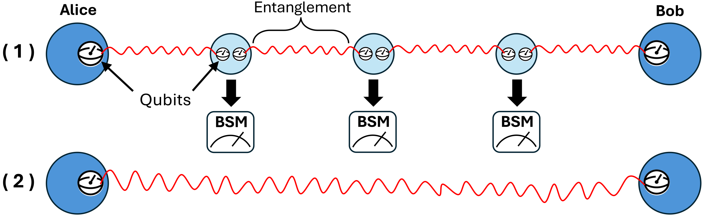
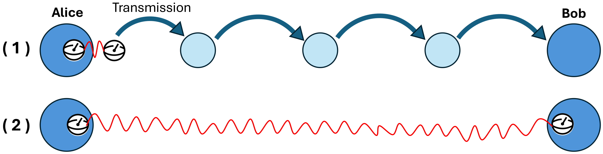

# [Register Networks](@id register-networks)

A [`RegisterNet`](@ref) joins an undirected graph with one [`Register`](@ref) per vertex.

## Construct a Network

Give `RegisterNet` a `SimpleGraph` and one register for each vertex:

```julia
using QuantumSavory, Graphs

graph = path_graph(3)
net = RegisterNet(graph, [Register(2) for _ in 1:3])
```

If you omit the graph, `RegisterNet` makes a chain:

```julia
net = RegisterNet([Register(2), Register(2), Register(2)])
```

## Use the Supported Graph Interface

`RegisterNet` supports a small part of the Graphs.jl API directly:

| Operation | Result |
|:--|:--|
| `vertices(net)` | Vertex identifiers |
| `edges(net)` | Undirected graph edges |
| `neighbors(net, i)` | Vertices adjacent to `i` |
| `nv(net)` | Number of vertices |
| `ne(net)` | Number of edges |
| `adjacency_matrix(net)` | Graph adjacency matrix |

For example:

```julia
collect(vertices(net))
collect(edges(net))
neighbors(net, 2)
```

A `RegisterNet` is not a subtype of `Graphs.AbstractGraph`. Do not assume that
other Graphs.jl functions accept it. Keep the graph used for construction when
you need the full Graphs.jl API. Treat the topology as fixed after construction.

## Index Registers and Slots

One index selects a register. A second index selects a slot and returns a
[`RegRef`](@ref):

```julia
node = net[2]        # a Register
slot = net[2][1]     # a RegRef
slot == net[2, 1]    # compact form
```

Colon indexing selects the same layer from all nodes:

| Expression | Result |
|:--|:--|
| `net[:]` | All registers |
| `net[:, j]` | Slot `j` from every register |

Every register must have slot `j` for `net[:, j]` to succeed. After you have a
`RegRef`, use the operations in the [Register Interface API](register_interface.md).

## Configure Names and Labels

Use `name` for the network display name. Use `names` for register display
names:

```julia
net = RegisterNet([Register(2) for _ in 1:3];
    name="line", names=["left", "middle", "right"])
```

These names appear in register and protocol displays. They do not change the
integer vertex identifiers.

Other static metadata uses the following indexing scheme:

```julia
net[1, :description] = "end node"
net[(1, 2), :length] = 20.0  # undirected edge
net[1 => 2, :loss] = 0.1     # directed edge
```

For undirected metadata, `(1, 2)` and `(2, 1)` select the same entry. For
directed metadata, `1 => 2` and `2 => 1` select separate entries. A metadata
read requires the key to exist.

For more sophisticated treatment of metadata, especially if it is used by
protocols being simulated in the network, consult the [tagging and querying infrastructure](metadata_plane.md).

## Configure Link Delays

The `classical_delay` and `quantum_delay` keywords set the direct-link delays.
A number applies to both directions of every edge:

```julia
net = RegisterNet(path_graph(3), [Register(2) for _ in 1:3];
    classical_delay=0.2, quantum_delay=0.1)
```

A two-argument callable sets a delay for each direction:

```julia
delay(src, dst) = src < dst ? 0.1 : 0.2
net = RegisterNet(path_graph(3), [Register(2) for _ in 1:3];
    classical_delay=delay)
```

The constructor calls `delay(src, dst)` and `delay(dst, src)` separately for
each graph edge. The delay advances simulation time. It does not wait in wall
clock time.

Classical channels can forward a message across more than one edge. Each hop
uses its configured delay. Quantum channels are direct-edge channels. Read
[Classical Messaging and Buffers](@ref classical-messaging) for channel and
message-buffer use.

## Choose a Delivery Model

The graph describes which nodes are directly connected. It does not select a
delivery model. A protocol can use the same path topology in two different
ways.



In a two-way model, neighboring nodes first establish short Bell pairs. The
intermediate nodes then perform entanglement swaps to create an end-to-end
pair. [`EntanglerProt`](@ref) and [`SwapperProt`](@ref) provide reusable parts
of this control flow; the simulation must configure and start them. The
[first-generation repeater how-to](@ref First-Generation-Quantum-Repeater-ProtocolZoo)
shows a complete example.



In a one-way model, an input state moves along the path one edge at a time.
Each [`qchannel`](@ref) is a direct-edge channel: it moves a state between two
adjacent registers with `put!` and `take!`. It does not route the state across
several edges. A user protocol must receive the state at each intermediate
node and send it over the next direct channel. The [Getting Started
Manual](@ref manual) demonstrates one direct quantum-channel handoff.

Use the [ProtocolZoo API](API_ProtocolZoo.md) to look up the reusable
entanglement protocols. Use [Classical Messaging and Buffers](@ref classical-messaging)
for the separate rules that govern direct and forwarded classical messages.

## Where to Go Next

- Read [Architecture and Mental Model](@ref architecture) for the role of a
  register network in the package.
- Read [Register Interface API](register_interface.md) for operations on slots.
- Read [Classical Messaging and Buffers](@ref classical-messaging) for network
  transport.
- Read [Visualizations](@ref Visualizations) to inspect a register network.
