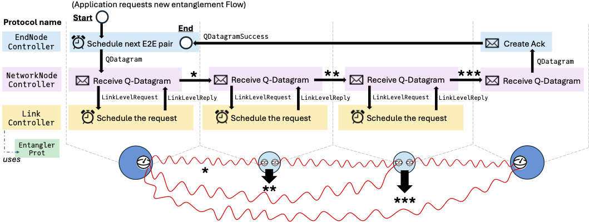

# [Standard Protocol Tags](@id standard-protocol-tags)

Tags and queries are the usual way for independently written QuantumSavory
processes to interact. A protocol publishes a classical fact as a tag or as a
message, and another protocol queries for that fact when it needs a resource,
an update, or a control-plane event.

Users are free and encouraged to define their own tags. A small symbolic tag is
often the clearest choice for local control flow:

```julia
tag!(reg[1], :ready_for_my_protocol, 7)
query(reg, :ready_for_my_protocol, W)
```

The standard tags below are different: they are the shared vocabulary used by
`ProtocolZoo`. Use them when a custom protocol should cooperate with existing
zoo protocols such as `EntanglerProt`, `SwapperProt`, `EntanglementTracker`,
`CutoffProt`, `EntanglementConsumer`, switch protocols, QTCP controllers, or
MBQC purification protocols.

## Custom Tags Versus Standard Tags

Use custom tags when the meaning is private to your protocol. Use standard tags
when another protocol is expected to understand the metadata. This convention
is what lets a custom component fit into an existing stack without directly
calling the internals of another protocol.

For example, `EntanglerProt` marks generated links with
`EntanglementCounterpart`. `SwapperProt` can then find such links by querying
for that tag, and `EntanglementTracker` can keep the metadata coherent after a
swap. A custom entangler can participate in the same stack by producing the
same tag schema.

Typed tags are represented as `Tag(TypeName, fields...)`. They can be attached
to register slots with `tag!`, sent as messages with `put!`, and matched with
`query`, `queryall`, or `querydelete!`.

## Entanglement Metadata Interface

These tags are the main interface between the first-generation repeater
protocols in `ProtocolZoo`.

### `EntanglementCounterpart`

```julia
Tag(EntanglementCounterpart, remote_node, remote_slot, pair_id)
```

Storage location: register slots.

Meaning: the local slot is entangled with `remote_node.remote_slot`, and the
pair is identified by `pair_id`.

Protocol interface:

- `EntanglerProt` produces reciprocal `EntanglementCounterpart` tags when it
  creates a Bell pair.
- `SwapperProt` consumes two such tags at the swapping node and sends update
  messages to the former endpoints.
- `EntanglementTracker` rewrites counterpart metadata after swap updates.
- `CutoffProt` queries it before deleting stale pairs and sending deletion
  notices.
- `EntanglementConsumer` queries reciprocal counterparts when it consumes an
  end-to-end pair.
- `SimpleSwitchDiscreteProt` queries it to find switch-client links that can be
  matched or deleted.

Typical query:

```julia
query(reg, EntanglementCounterpart, remote_node, W, W; assigned=true)
query(slot, EntanglementCounterpart, remote_node, remote_slot, pair_id)
```

If you create these tags manually, prefer a fresh id for a newly generated
pair:

```julia
pair_id = fresh_entanglement_id()
tag!(net[1][1], EntanglementCounterpart, 2, 1, pair_id)
tag!(net[2][1], EntanglementCounterpart, 1, 1, pair_id)
```

### `EntanglementHistory`

```julia
Tag(EntanglementHistory,
    remote_node, remote_slot,
    swap_remote_node, swap_remote_slot,
    swapped_local,
    local_chunk_id, swapped_chunk_id)
```

Storage location: register slots at nodes that performed swaps.

Meaning: the slot used to be entangled with `remote_node.remote_slot`, but was
locally swapped with `swapped_local`, whose remote endpoint was
`swap_remote_node.swap_remote_slot`.

Protocol interface:

- `SwapperProt` creates history tags after a swap.
- `EntanglementTracker` consumes or updates history tags when delayed update or
  delete messages arrive for a pair whose local metadata has already changed.

Typical query:

```julia
query(slot, EntanglementHistory, old_node, old_slot, W, W, W, W, W)
```

### `EntanglementUpdateX` And `EntanglementUpdateZ`

```julia
Tag(EntanglementUpdateX,
    target_pair_id, other_pair_id,
    past_local_node, past_local_slot, past_remote_slot,
    new_remote_node, new_remote_slot,
    correction)

Tag(EntanglementUpdateZ,
    target_pair_id, other_pair_id,
    past_local_node, past_local_slot, past_remote_slot,
    new_remote_node, new_remote_slot,
    correction)
```

Storage location: message buffers.

Meaning: a remote node performed a swap. The receiver should update the
counterpart metadata for the target pair, combine in the other pair-id chunk,
and apply the indicated Pauli-frame correction if needed.

Protocol interface:

- `SwapperProt` sends these messages to the former endpoints of the two swapped
  links.
- `EntanglementTracker` consumes them and updates local counterpart/history
  metadata.
- Custom protocols that perform their own swaps can use these tags to notify
  the standard tracker.

Typical query:

```julia
querydelete!(messagebuffer(net, node),
    EntanglementUpdateX, W, W, W, W, W, W, W, W)
```

### `EntanglementDelete`

```julia
Tag(EntanglementDelete, target_pair_id, send_node, send_slot, rec_node, rec_slot)
```

Storage location: message buffers and, temporarily, register slots.

Meaning: one side of a pair has been deleted or decohered, and the other side
must clear matching metadata and trace out the corresponding qubit.

Protocol interface:

- `CutoffProt` sends deletion messages after it removes stale entanglement.
- `EntanglementTracker` consumes deletion messages and forwards or stores them
  when swaps have changed the endpoint metadata.
- `SwapperProt` and cleanup logic rely on this tag to avoid leaving stale
  counterpart information behind.

Typical query:

```julia
querydelete!(messagebuffer(net, node),
    EntanglementDelete, target_pair_id, W, W, node, W)
```

### `DistilledTag`

```julia
Tag(DistilledTag)
```

Storage location: register slots.

Meaning: the slot holds the surviving pair from a successful BBPSSW
distillation round.

Protocol interface:

- `BBPSSWProt` adds this tag to both slots of the surviving pair after a
  successful round, unless it is configured with `tag=nothing`.
- By default, `BBPSSWProt` also uses the configured tag as its slot filter:
  slots already carrying `DistilledTag` are not selected for another round by
  the same kind of distiller.
- Custom protocols can query this tag when they need to consume only distilled
  pairs, or they can replace it with their own fieldless tag by passing
  `tag=MyTag` to `BBPSSWProt`.

Typical query:

```julia
query(reg, DistilledTag)
query(slot, DistilledTag)
```

## Entanglement IDs

Some standard entanglement tags carry fields of type `EntanglementID`. These ids
are not just display metadata. They are the identity of an entangled pair across
swap, update, and delete events.

If a custom protocol manipulates `EntanglementCounterpart`,
`EntanglementHistory`, `EntanglementUpdateX`, `EntanglementUpdateZ`, or
`EntanglementDelete`, it must preserve the id semantics expected by
`EntanglerProt`, `SwapperProt`, `EntanglementTracker`, `CutoffProt`, and
`EntanglementConsumer`.

Use:

- `fresh_entanglement_id()` for a newly generated physical pair.
- `combine_entanglement_ids(id1, id2)` when a swap combines pair-id chunks.
- `NO_ENTANGLEMENT_ID` only for legacy/custom workflows that do not participate
  in pair-id-sensitive tracking.

```@docs; canonical=false
EntanglementID
fresh_entanglement_id
combine_entanglement_ids
```

## Switch Interface

### `SwitchRequest`

```julia
Tag(SwitchRequest, requester, remote_node)
```

Storage location: switch node message buffers.

Meaning: `requester` asks the switch to establish entanglement with
`remote_node`.

Protocol interface:

- Clients send this message to a switch node.
- `SimpleSwitchDiscreteProt` consumes these requests, updates its backlog, and
  attempts switch-mediated entanglement according to its assignment algorithm.

Typical query:

```julia
querydelete!(messagebuffer(net, switch_node), SwitchRequest, W, W)
```

## QTCP Interface

QTCP tags are subsystem-specific control-plane messages. They are standard
within the QTCP controller stack and are useful when customizing QTCP behavior.



The figure summarizes the QTCP controller API: applications submit `Flow`
requests to end-node controllers, end nodes create and acknowledge `QDatagram`
messages, network-node controllers request hop-by-hop link resources, and link
controllers answer with the link-level reply tags consumed by the higher layers.

### Flow Requests And Endpoints

```julia
Tag(Flow, src, dst, npairs, uuid)
Tag(QTCPPairBegin, flow_uuid, flow_src, flow_dst, seq_num, memory_slot, start_time)
Tag(QTCPPairEnd, flow_uuid, flow_src, flow_dst, seq_num, memory_slot, start_time)
```

Storage location: message buffers for `Flow`, node registers for pair-completed
notifications.

Protocol interface:

- Users or applications put `Flow` at the source node to request end-to-end
  Bell pairs.
- `EndNodeController` consumes `Flow`, creates `QDatagram` messages, and emits
  `QTCPPairBegin` or `QTCPPairEnd` when a pair reaches the endpoints.
- Custom end-node controllers can use the same tags to remain compatible with
  the rest of the QTCP stack.

Typical queries:

```julia
querydelete!(messagebuffer(net, src), Flow, src, W, W, W)
query(net[src], QTCPPairBegin, flow_uuid, src, dst, W, W, W)
query(net[dst], QTCPPairEnd, flow_uuid, src, dst, W, W, W)
```

### Datagram And Acknowledgement Messages

```julia
Tag(QDatagram, flow_uuid, flow_src, flow_dst, correction, seq_num, start_time)
Tag(QDatagramSuccess, flow_uuid, seq_num, start_time)
```

Storage location: message buffers.

Protocol interface:

- `EndNodeController` creates `QDatagram` messages for each requested pair.
- `NetworkNodeController` routes datagrams hop by hop and requests link-level
  entanglement for the next hop.
- The destination `EndNodeController` turns a received datagram into
  `QDatagramSuccess`, which acknowledges completion back to the source.

Typical query:

```julia
querydelete!(messagebuffer(net, node), QDatagram, W, W, node, W, W, W)
```

### Link-Level QTCP Messages

```julia
Tag(LinkLevelRequest, flow_uuid, seq_num, remote_node)
Tag(LinkLevelReply, flow_uuid, seq_num, memory_slot)
Tag(LinkLevelReplyAtSource, flow_uuid, seq_num, memory_slot)
Tag(LinkLevelReplyAtHop, flow_uuid, seq_num, memory_slot)
```

Storage location: message buffers or node-local metadata used by QTCP
controllers.

Protocol interface:

- `NetworkNodeController` produces `LinkLevelRequest` when a datagram needs
  entanglement to the next hop.
- `LinkController` consumes requests and returns `LinkLevelReply` to the
  requester and `LinkLevelReplyAtHop` to the remote hop.
- `NetworkNodeController` converts replies into forwarded datagrams or
  source-side bookkeeping through `LinkLevelReplyAtSource`.
- `EndNodeController` consumes the source/hop replies when turning a completed
  datagram into endpoint pair notifications.

Typical queries:

```julia
querydelete!(messagebuffer(net, node), LinkLevelRequest, flow_uuid, seq_num, W)
querydelete!(messagebuffer(net, node), LinkLevelReply, flow_uuid, seq_num, W)
```

## MBQC And Purification Interface

These tags are subsystem-specific metadata for graph-state construction and
MBQC-based purification.

### `GraphStateStorage`

```julia
Tag(GraphStateStorage, uuid, vertex)
```

Storage location: storage-qubit register slots.

Protocol interface:

- `GraphStateConstructor` tags each storage qubit with the graph-state uuid and
  vertex it represents.
- Follow-up graph-state or resource-state protocols can query this tag to find
  the physical storage slot for a logical graph vertex.

Typical query:

```julia
query(reg, GraphStateStorage, graph_uuid, vertex)
```

### `PurifierBellMeasurementResults`

```julia
Tag(PurifierBellMeasurementResults, node, measurements_XX, measurements_ZZ)
```

Storage location: local register slots and message buffers.

Protocol interface:

- `PurifierBellMeasurements` produces local bit-packed Bell-measurement results
  and sends them to the remote chief node.
- `MBQCPurificationTracker` consumes local and remote results, computes the
  purification syndrome, and either tags purified pairs or cleans up failed
  resources.

Typical query:

```julia
querydelete!(messagebuffer(net, chief),
    PurifierBellMeasurementResults, remote_chief, W, W)
```

### `PurifiedEntanglementCounterpart`

```julia
Tag(PurifiedEntanglementCounterpart, remote_node, remote_slot)
```

Storage location: storage-qubit register slots.

Protocol interface:

- `MBQCPurificationTracker` produces this tag when purification succeeds.
- Custom consumers can query it to find purified Bell pairs without knowing the
  internal purification workflow.

Typical query:

```julia
query(reg, PurifiedEntanglementCounterpart, remote_node, W; assigned=true)
```

## Exact Type Reference

```@docs; canonical=false
EntanglementCounterpart
EntanglementHistory
EntanglementUpdateX
EntanglementUpdateZ
QuantumSavory.ProtocolZoo.EntanglementDelete
QuantumSavory.ProtocolZoo.DistilledTag
SwitchRequest
Flow
QTCPPairBegin
QTCPPairEnd
QDatagram
QuantumSavory.ProtocolZoo.QTCP.QDatagramSuccess
LinkLevelRequest
LinkLevelReply
LinkLevelReplyAtSource
LinkLevelReplyAtHop
QuantumSavory.ProtocolZoo.MBQCEntanglementDistillation.PurifierBellMeasurementResults
QuantumSavory.ProtocolZoo.MBQCEntanglementDistillation.PurifiedEntanglementCounterpart
```

## Where To Go Next

- Read [Tagging and Querying](@ref tagging-and-querying) for the generic tag
  and query API.
- Read [Metadata and Protocol Composition](@ref metadata-plane) for the design
  model behind protocol communication.
- Read [Predefined Networking Protocols](API_ProtocolZoo.md) for the protocol
  implementations that produce and consume these tags.
