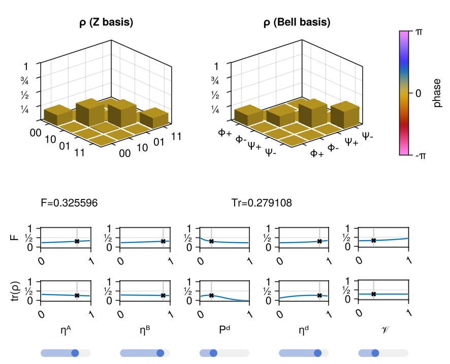

# Interactively visualizing two-qubit states

The [`QuantumSavory.StatesZoo.stateexplorer`](@ref) routine lets you generate an interactive state visualizer, **that can also be used as an input state in interactive live simulations**.

E.g. take the Barrett-Kok dual-rail heralded entanglement procedure -- it produces a state that is available from [`QuantumSavory.StatesZoo`](@ref Predefined-Models-of-Quantum-States) as [`BarrettKokBellPairW`](@ref). The following is enough to generate the interactive `Makie` figure:

```julia
stateexplorer!(fig, BarrettKokBellPairW)
```



This is useful when you want to work with realistic surrogate states without
digging into the full derivation of the underlying physical model. The sliders
let you sweep the parameters of the chosen state family, while the plotted
figures of merit help you see how those choices affect entanglement quality and
other diagnostics.

Below we embed a live version of this state explorer (hosted at [areweentangledyet.com/state_explorer/](https://areweentangledyet.com/state_explorer/)):

```@raw html
<iframe class="liveexample" src="https://areweentangledyet.com/state_explorer/" style="height:600px;width:850px;"></iframe>
```

The source code is in the [`examples/state_explorer`](https://github.com/QuantumSavory/QuantumSavory.jl/tree/master/examples/state_explorer) folder.
