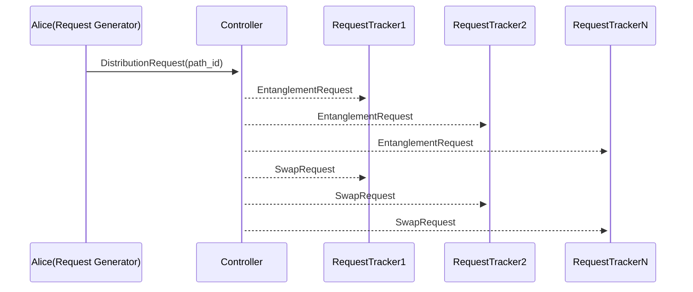
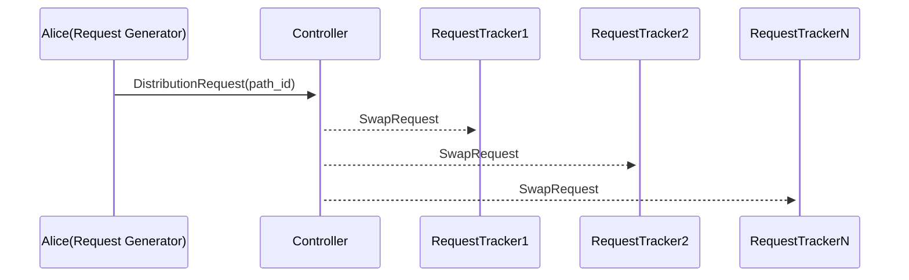

Different control plane architectures with arbitrary network topologies can be simulated using QuantumSavory. The `setup.jl` contains basic functionality required by the simulations. The other files are described below:

1a. A simulation that generates an interactive visualization for a connectionless, distributed and decentralized entanglement distribution network

1b. An interactive web app with the same simulation as 1a

2a. A simulation that generates an interactive visualization for a connection-oriented, non-distributed and centralized entanglement distribution network

2b. An interactive web app with the same simulation as 2a

The connection-oriented control protocol is illustrated at a high level by the sequence diagram below:

For the connection-less protocol we have pre=emptive entanglement generation and swaps are performed when a request is received at the controller

The `RequestGenerator` (Alice) sends a message to the controller, requesting entanglement generation with an end node (Bob).
The message contains index of the path selected by Alice and the controller sends `EntanglementRequest`s to the nodes on the path followed by `SwapRequest`s