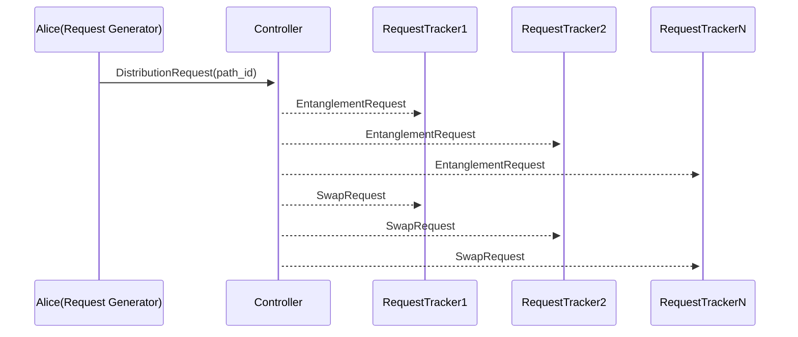
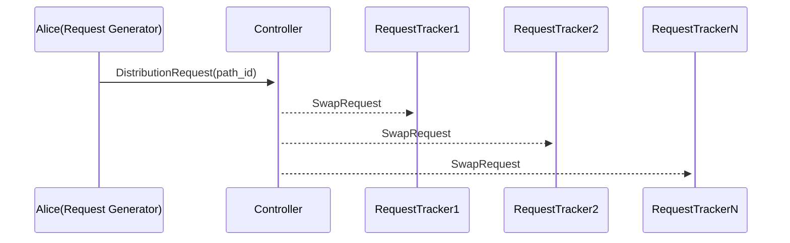

Different control plane architectures with arbitrary network topologies can be simulated using QuantumSavory. The `setup.jl` contains basic functionality required by the simulations. The other files are described below:

1a. A simulation that generates an interactive visualization for a connectionless, distributed and decentralized entanglement distribution network

1b. An interactive web app with the same simulation as 1a

2a. A simulation that generates an interactive visualization for a connection-oriented, non-distributed and centralized entanglement distribution network

2b. An interactive web app with the same simulation as 2a

3a. A simulation that generates an interactive visualization for a connection-less, non-distributed and centralized entanglement distribution network

3b. An interactive web app with the same simulation as 3a

4 A script that generates a visualization for side-by-side comparison of the connection-oriented and connection-less approaches with a single user-pair.

5 A script that generates a visualization for the connection-oriented approach comparing performance in case of single user pair vs two user pairs.

The connection-oriented control protocol is illustrated at a high level by the sequence diagram below:

The `RequestGenerator` (Alice) sends a message to the controller, requesting entanglement generation with an end node (Bob).
The message contains index of the path selected by Alice and the controller sends `EntanglementRequest`s to the nodes on the path followed by `SwapRequest`s

For the connection-less protocol we have pre-emptive entanglement generation and swaps are performed at all the nodes except the user pair when a request is received at the controller.

Note: The connection-less controller is currently limited to only one user pair since having multiple distinct user pairs run swaps at the user pair of other requests, which leads to cyclic swaps(two qubits of the same node getting entangled to each other through swaps due to different swap predicate priorities for different user pairs)