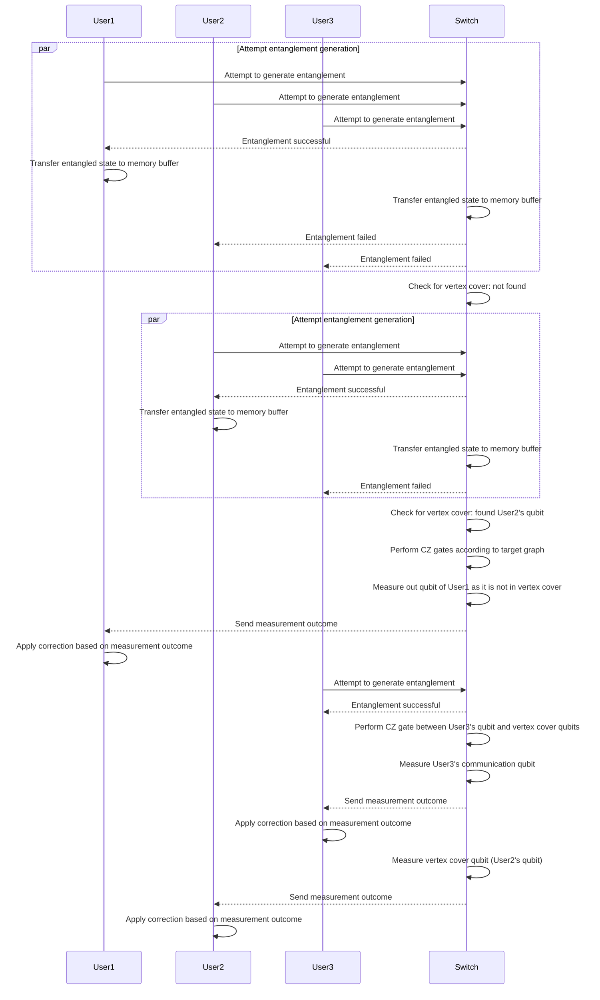

# System Overview
We are given multiple users of a quantum network. The goal of these users is to share some given graph state |G⟩. A graph state |G⟩ is an entangled state that can be presented with a graph $G(V,E)$. A vertex $i \in V$ of this graph presents a qubit in the state |+⟩, while a connecting edge $(i,j) \in E$ presents a `CZ` operation between a pair of qubits $(i,j)$, where $i\ne j$. In order to generate such a graph state, the users first need to connect to a central switch node. This special purpose node is equipped with a quantum processor, which performs the necessary operations to generate the desired state for the users.

In this setup, a number of users create bipartide entanglement with the switch over a physical connection (e.g., optical fiber) using communication qubits on both ends of the connection (one comm qubit at the user and one at the switch side). Both the switch and the users come with some storage capacity of memory qubits termed $m_s$ and $m_c$, respectively. We assume that the communication qubits can access all memory qubits on their respective side. As a result, a successful user can swap its entangled state from the comm. qubits directly to any free pair of memory qubits. 

# Graph state generation
The system follows the following protocol to generate a shared graph state:
1. All users attempt to generate an entangled state with the switch ($n$ entanglement processes therefore run in parallel).
2. At each clock cycle, the switch checks if the current set of qubits forms a vertex cover of the target state or any LC equivalent graph state (1). 
3. If there is no vertex cover found yet, successful users transfer their state to the memory buffer.
4. As soon as a vertex cover is found, the switch performs `CZ` gates between the set of qubits according to the target graph (which can be either |G⟩ , |G′⟩) and measures out all qubits present which are not part of the vertex cover.
5. Whenever one of the remaining users manages to generate an entangled state, it goes through the following four steps: a) the switch performs `CZ` gates between the users' communication qubit and the associated qubits in the vertex cover; b) the switch measures the users' communication qubit; c) sends the measurement outcome to the client and d) the client applies a correction Pauli gate depending on the measurement outcome.
6. Wait until all users were successful. 
7. The switch measures the memories forming the vertex cover, which projects the desired graph state fully back to the cients. 
8. As a final step, each user performs the required single-qubit Clifford operations (this is only necessary if an LC equivalent state |G′⟩ was generated). 

(1) Two graph states |G⟩ , |G′⟩ are equivalent up to single-qubit Clifford operations if and only if G and G′ are LC

### Protocol flow
Below we give an example of how a generation of a simple three-qubit graph state could look like. The desired graph state is $1--2--3$. With vertices $V = \{1,2,3\}$ and $E = \{(1,2), (2,3)\}$.
