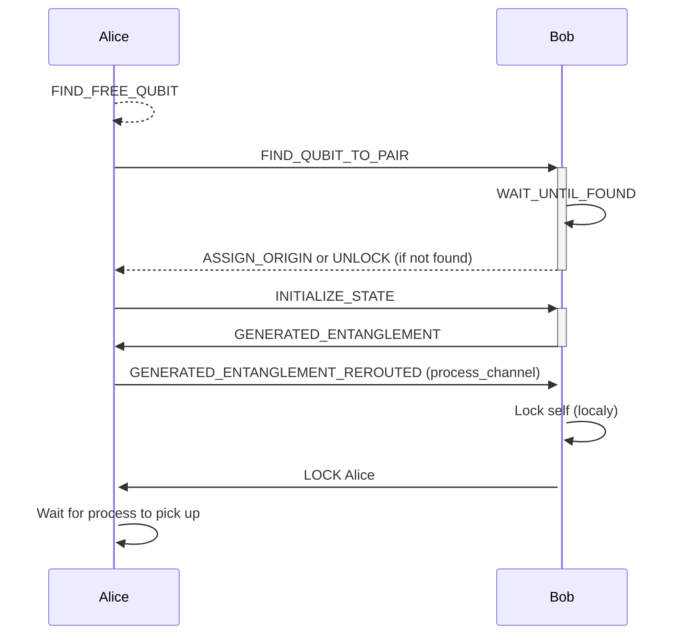
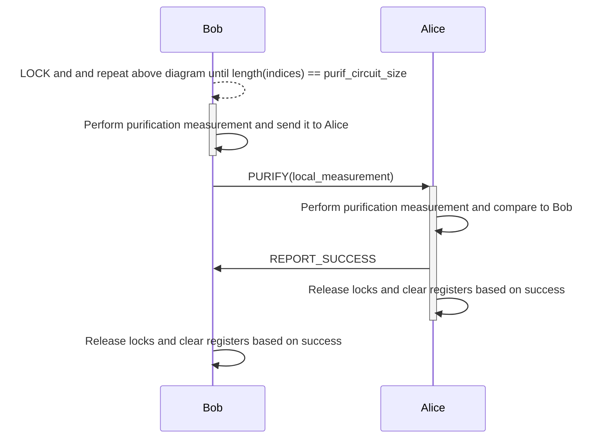
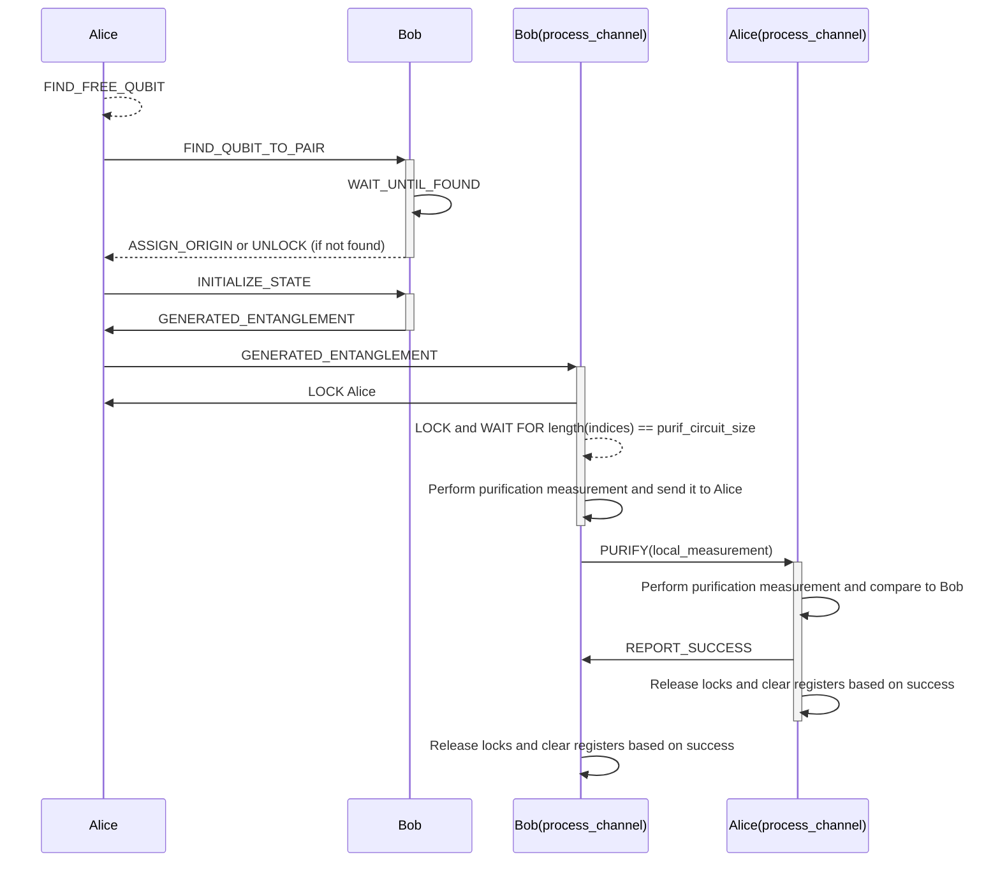

# Message Passing Distilation

## Using the Free Qubit Trigger

In the world we live in, we are only able to directly affect and know about objects/information
in our proximity. To be able to provide a network with entanglement, as a chain repeater does, we would need to employ a message passing protocol that let's other nodes in the network know what our node needs or what it can provide.

This is why, in this example we will go over one way to do exactly that: We will set up a protocol that provides nodes with entanglement on request, and purifies said entanglement.
You might notice that in this example we (for now) omit swapping. That is because to understand the protocol and the code we need to take it step by step and start froma  2 node network.

The communication processes between 2 nodes of the same edge are set up in `setup.jl`, and are the following (and can be found mor indepth in the next section):

- the **free_qubittrigger**, which is added to one single node from each edge of the network to prevent overlocking, and signals a free local slot when one is found
- the **entangler** which replies to the **free_qubittrigger** and finds a pair for the node that it replies to
- and the **purifier** which waits for the **entangler** to entangle enough pairs for it to be able to perform purification.

Each of the three listens on a channel tied to each of the network's edges.

This example is split into 4 files that are set up this way for easier delimitation of
what this simulation does. We have:

- `setup.jl` : sets up the simulation and the three processes above
- `1_entangler_purifier_console.jl` : records a the simulation and saves it as a video
- `2_wglmakie_fullstack.jl` : shows the interactive simulation in a web browser
- `cssconfig.jl` : css style and configurations used by `2_wglmakie_fullstack.jl`

One goal of this example is to not only understand a way of passing messages to request entanglement, but to also initiate one to quantum entanglement purification. 

In the given example we select and compare two types of circuits: 2 to 1 (Single Selection)
and 3 to 1 (Double Selection). We notice that the 3 to 1 circuit outperforms the 2 to 1 circuit
in terms of final vs initial fidelity, but the probability for a 3 to 1 to actually succeed in creating a high fidelity pair is lower than a 2 to 1's. This can be observed to it's best extent when enabling the `recycle purif pairs` option on the web simulation.

# The web simulation

The web simulation is split into two panels that display the same simulation, but have different auxiliary plots and sliders for the user to play with. They are explained in the simulation's main page and also in the docs.

We chose to split the simulation as such for the users to focus on the important parts of each step of the protocol rather than needing temselves to figure out what each slider is tied to.

# Chart flow of the protocol

Entanglement (simple channel)


Purification (on process channel)



Coupled purification after entanglement



# Important
if graphs are too large/too little on retina screens specifically on macos,
go to Sim.jl line 13 and modify
```julia
retina_scale = 1 # modify to 2 instead of 1
```
