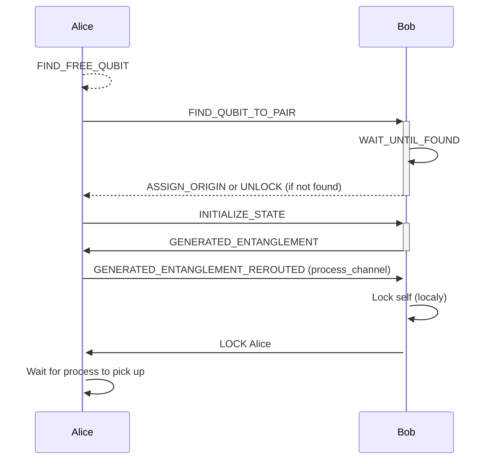
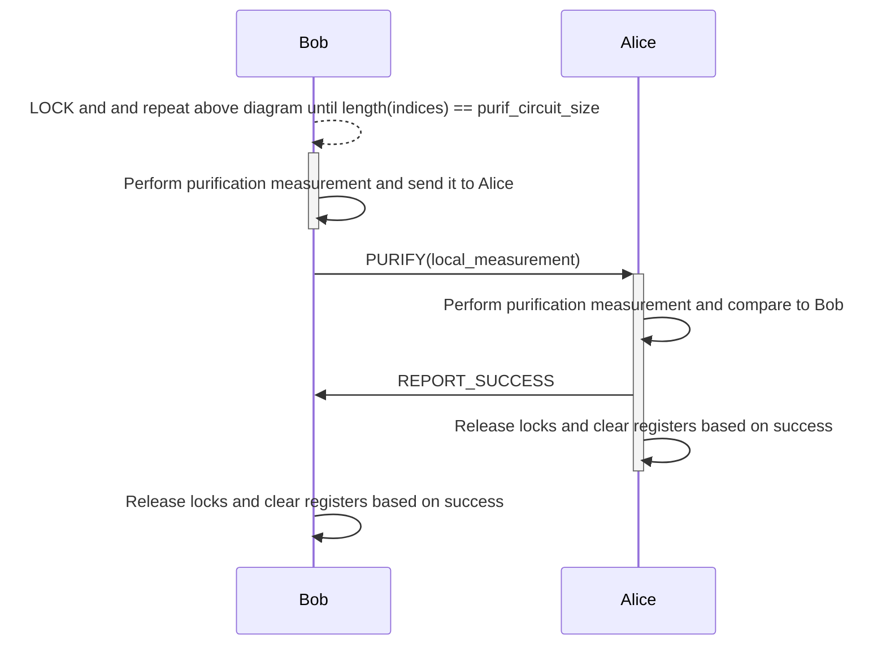
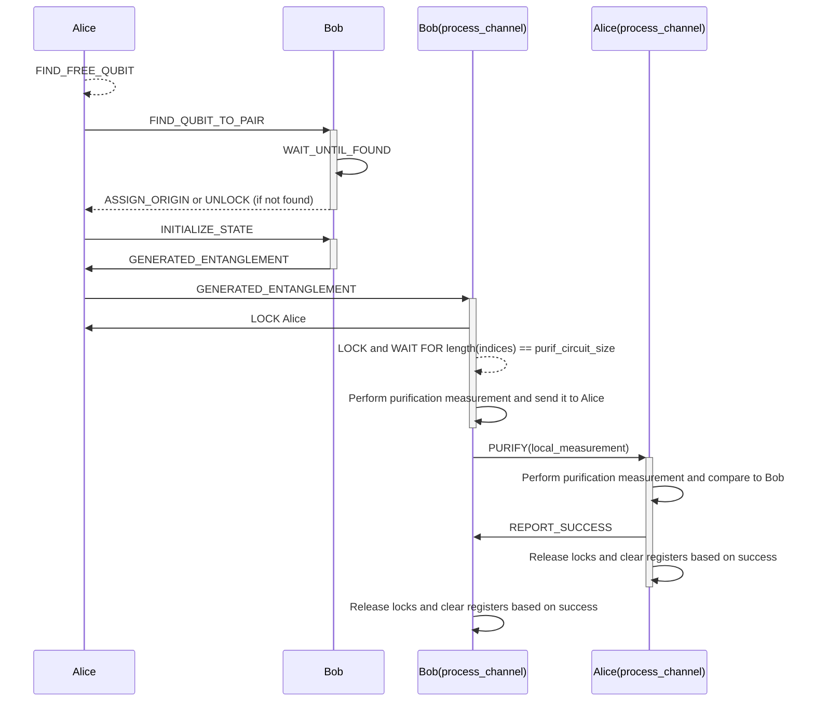

# Chart flow of the protocol

Entanglement (simple channel)


Purification (on process channel)



Coupled purification after entanglement



# Important
if graphs are too large/too little on retina screens specifically on macos,
go to Sim.jl line 13 and modify
```julia
retina_scale = 1 # modify to 2 instead of 1
```
