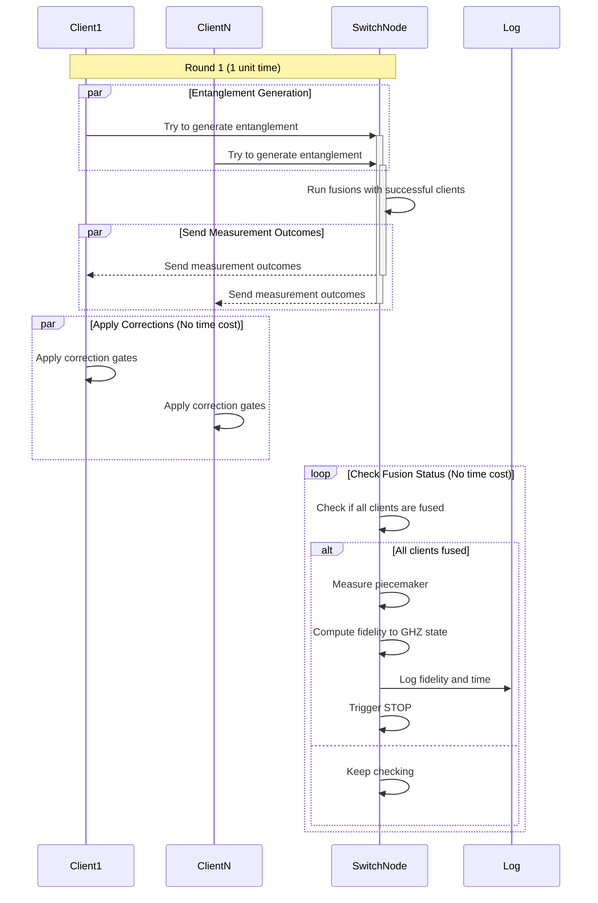

# System Overview
The goal is to share a GHZ state among multiple users. To do so, the clients connect to a central switch node, which then serves the GHZ state to them. Each of the $n$ clients can store one memory qubit in its memory buffer and one qubit at the switch side. In addition the switch's register holds a dedicated 'piecemaker' slot - a qubit in the $|+\rangle$ state, which all successfull clients fuse their switch'side qubits with.

# Entanglement Distribution
In each time step, $n$ entanglement processes run in parallel. Upon completion of an entanglement link, it is fused with the piecemaker qubit. Once all clients went through this fusion operation, the piecemaker qubit is measured. This projects the state back to the clients, resulting in the desired shared GHZ state.

# Fusion Operation
The fusion operation is performed on the switch node. Let's take a client who just managed to generate a bipartide entangled state -- entangled link -- with its associated qubit at the switch side. The switch executes a `CNOT` gate on the client's qubit (target) and the piecemaker qubit (control). Next, the switch measures the client qubit in the computational basis and sends the outcome to the client (in order to apply the necessary Pauli correction). This procedure merges the bipartide state into the (entangled) state that the piecemaker qubit is currently part of, modulo any required Pauli corrections.

# Noise 
The memories residing in the nodes' `Register`s suffer from depolarizing noise, see [`Depolarization`](https://github.com/QuantumSavory/QuantumSavory.jl/blob/2d40bb77b2abdebdd92a0d32830d97a9234d2fa0/src/backgrounds.jl#L18). 

### Protocol flow

