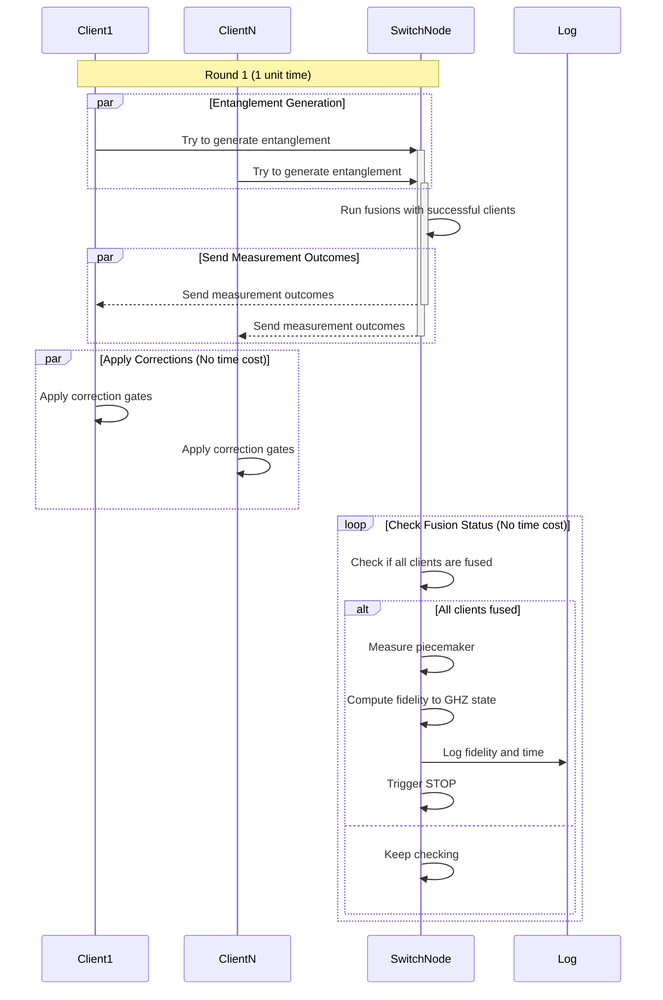

# System Overview
A central switch node connects to $n$ clients. The switch possesses $m = n + 1$ qubit slots, while each client has a single qubit slot.

# Entanglement Initiation
At each clock tick, the switch initiates entanglement attempts with each of the $n$ clients, resulting in $n$ entanglement processes per cycle. Successful entanglement links are then merged into a GHZ (Greenberger–Horne–Zeilinger) state using an additional "piecemaker" qubit located in the $(n + 1)$th slot of the switch node. This fusion process is assumed to occur instantaneously. Once all clients went through the fusion operation, the piecemaker qubit is measured out. This completes the fusing process and all nodes are sharing an n-GHZ state.

# Fusion Operation
The fusion operation consists of applying a `CNOT` gate followed by a measurement in the computational basis. This procedure allows the merging of two GHZ states into a single GHZ state, modulo any required Pauli corrections. We iterate over all existing entangled states with the switch node: in each iteration, the piecemaker qubit (initialized in the state $|+\rangle$) is fused with one of the existing entangled states. 

# Noise 
The memories residing the nodes' `Register`s suffer from depolarizing noise. 

### Protocol flow

