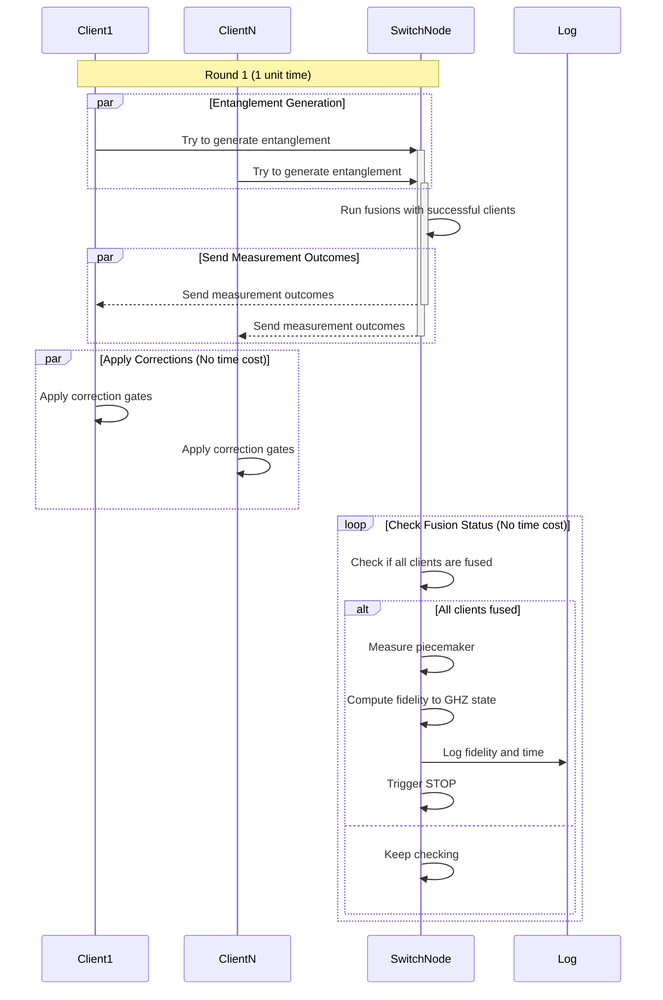

# Distributing a GHZ state with a quantum entanglement switch

Live version is at [areweentangledyet.com/piecemakerswitch/](https://areweentangledyet.com/piecemakerswitch/).

In this setup, multiple nodes (user nodes) connect to a central node (switch node) trough bipartite entangled states. The switch node performs fusion operations on these shared states to create a GHZ state among the user nodes. The goal is to do the latter as memory efficient as possible. Each of the $n$ clients can store one memory qubit in its memory buffer and one qubit at the switch side. In addition the switch's register holds a dedicated 'piecemaker' slot - a qubit in the $|+\rangle$ state, which all successfull clients fuse their switch'side qubits with. We term this protocol the _piecemaker_ protocol, see ref.[1].

In each time step, $n$ entanglement generation processes run in parallel. Upon creation of an entanglement link, it is fused with the piecemaker qubit. Once all clients went through this fusion operation, the piecemaker qubit is measured. This projects the state back to the clients, resulting in the desired shared GHZ state.
The fusion operation is performed on the switch node: Let's take a client who just managed to generate a bipartide entangled state -- entangled link -- with its associated qubit at the switch side. The switch executes a `CNOT` gate on the client's qubit (target) and the piecemaker qubit (control). Next, the switch measures the client qubit in the computational basis and sends the outcome to the client (in order to apply the necessary Pauli correction). This procedure merges the bipartide state into the (entangled) state that the piecemaker qubit is currently part of, modulo any required Pauli corrections.

NOTE: The memories residing in the nodes' `Register`s suffer from depolarizing noise, see [`Depolarization`](https://qs.quantumsavory.org/stable/API/#QuantumSavory.Depolarization). 

The `setup.jl` file implements all necessary base functionality.
The other files run the simulation and generate visuals in a number of different circumstances:
1. `simple_run.jl` A single simulator script convenient for exploratory coding, running a numer of Monte Carlo simulations;
2. `live_visualization_interactive` A web-app version of the simulator;
3. `static_viz.jl` A script running a number of of simulations like the ones in point 1, followed by plotting the fidelity over the protocol's execution time.

Documentation:
- [The "How To" doc page on setting up this simulation](https://qs.quantumsavory.org/dev/howto/piecemakerswitch/piecemakerswitch)

[1] [Prielinger et al., 2025](https://arxiv.org/abs/2508.14737)

### Protocol flow

