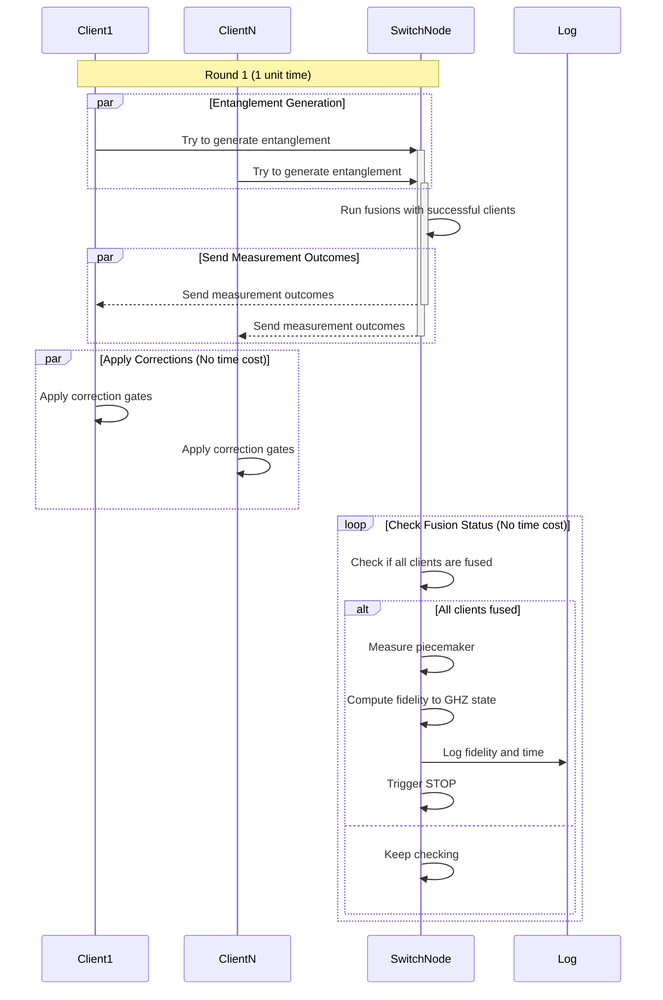

# System Overview
The goal is to share a GHZ state among multiple users. To do so, the clients connect to a central switch node, which then produces the GHZ state for them.

In this setup, a number of clients connect to a central hub, which we call the switch node. Each of the $n$ clients can store one memory qubit in its memory buffer and one qubit at the switch side. This makes up for $n$ memory qubits on the switch node. However, the switch contains an additional qubit, $n+1$ which we call the 'piecemaker' slot - a qubit in the $|+\rangle$ state, which is needed in the GHZ generation process.

# Entanglement Initiation
At each clock tick, the switch initiates entanglement attempts with each of the $n$ clients. So we have $n$ entanglement processes running in parallel per cycle. Successful entanglement links are immediately fused with the piecemaker qubit. Once all clients went through this fusion operation, we measure the piecemaker qubit. The latter projects the state back to the clients, resulting in the desired shared GHZ state.

# Fusion Operation
The fusion operation is performed on the switch node. Let's take a client who just managed to generate a bipartide entangled state with its associated qubit at the switch. The switch then immediately executes a `CNOT` gate on the client's qubit and the piecemaker qubit. Next, the switch measures the client qubit in the computational basis and sends the outcome to the client (in order to apply the necessary Pauli correction). This procedure merges the bipartide state into the (entangled) state that the piecemaker qubit is currently part of, modulo any required Pauli corrections.

# Noise 
The memories residing in the nodes' `Register`s suffer from depolarizing noise. 

### Protocol flow

